# Graficos basicos para elegir variables

Estos graficos se generan desde `proyecto.py` usando los datos procesados. Son exploratorios: ayudan a elegir variables candidatas, no prueban causalidad.

## Reglas para leerlos

- Para modelo de ventas: mirar pais, producto, categoria, segmento, mercado, mes, metodo de pago y senales web.

- Para modelo de retraso/pedido problematico: mirar modo de envio, pais, mercado, fecha/hora y variables disponibles antes del envio.

- Evitar leakage: no usar variables que ocurren despues del resultado que se quiere predecir.

## Graficos

### Ventas por pais

Muestra si el pais tiene senal fuerte para ventas y demanda.

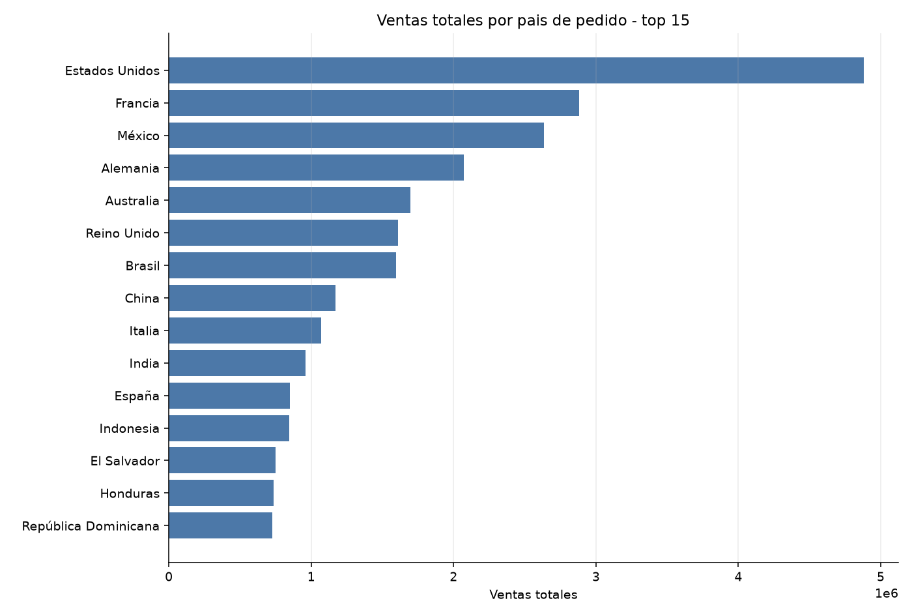

### Ventas por producto

Ayuda a ver productos dominantes y posible concentracion de demanda.

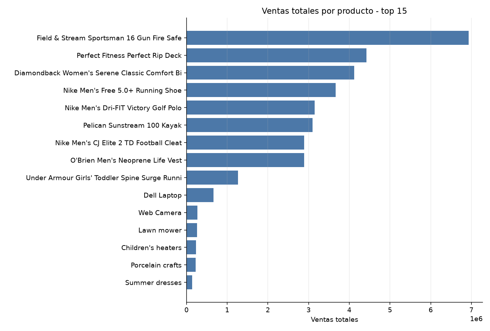

### Ventas por categoria

Las categorias suelen ser buenas features por capturar familias de producto.

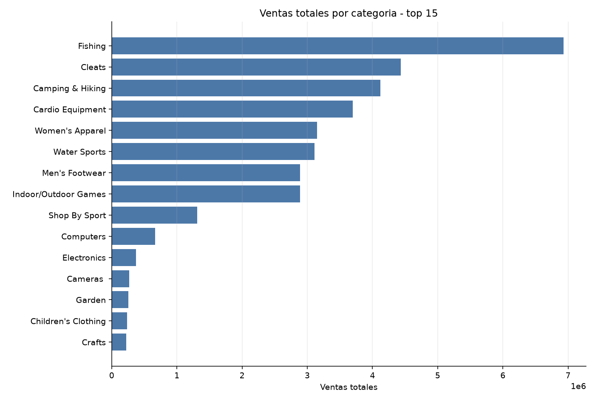

### Ventas por segmento

Permite ver si Consumer, Corporate o Home Office tienen comportamientos diferentes.

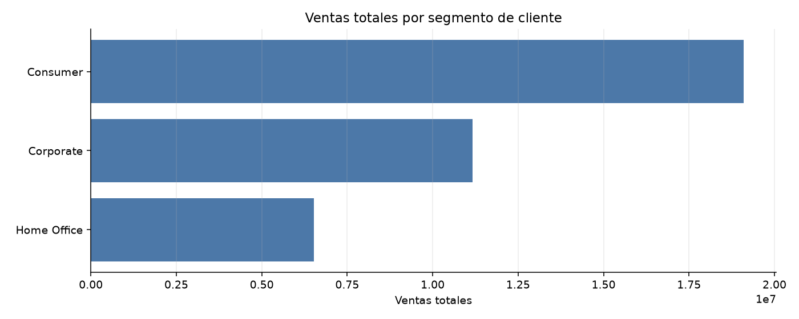

### Ventas por mercado

Resume diferencias regionales de demanda.

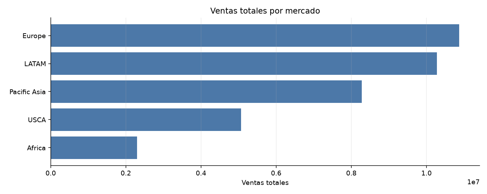

### Ventas por metodo de pago

Sirve para ver si el metodo de pago acompana patrones de compra sin codificarlo ordinalmente.

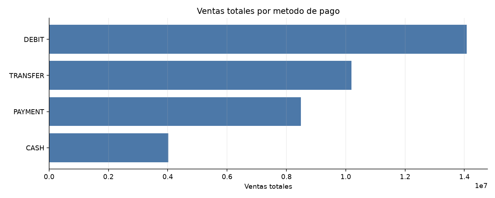

### Ventas por modo de envio

Puede aportar senal en demanda y en riesgo logistico.

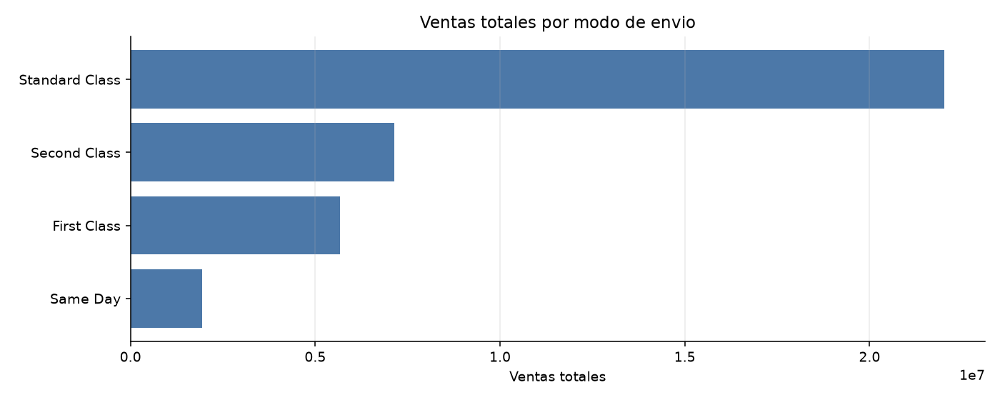

### Retraso por modo de envio

Muy relevante para un modelo de retraso, siempre cuidando no usar variables posteriores al evento.

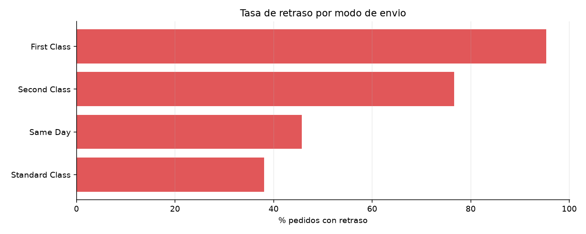

### Retraso por pais

Ayuda a detectar geografia con riesgo logistico alto.

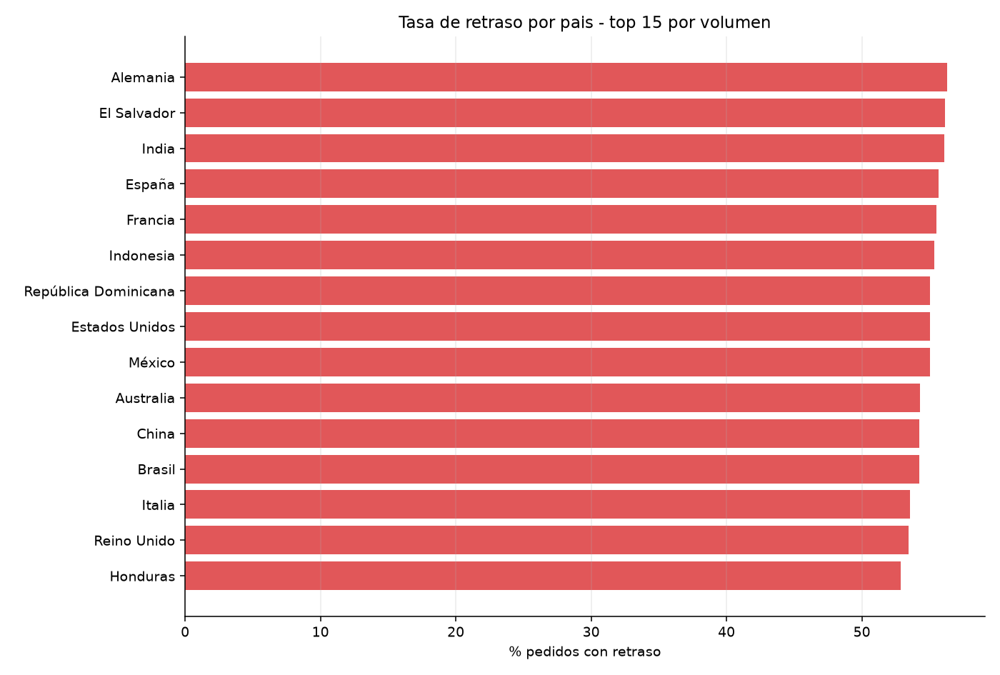

### Beneficio por categoria

No todo lo que vende mucho es lo que mas aporta margen; este grafico separa volumen de valor.

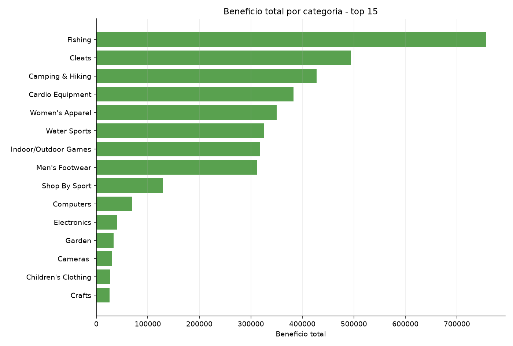

### Ventas por mes

Da una primera pista de estacionalidad.

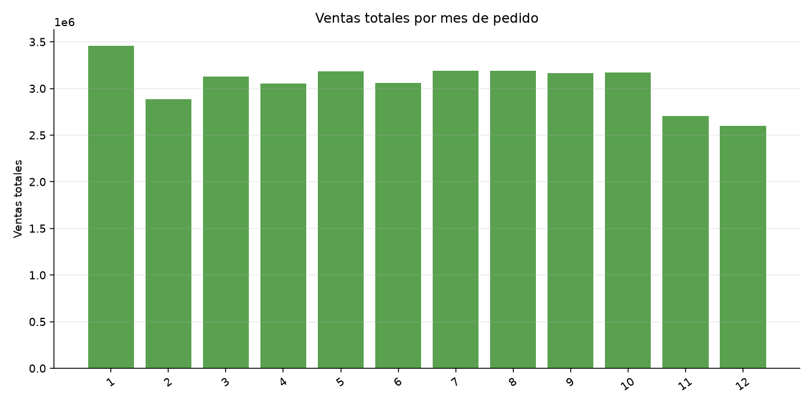

### Distribucion de Sales

Permite ver escala, concentracion y posibles outliers para el modelo.

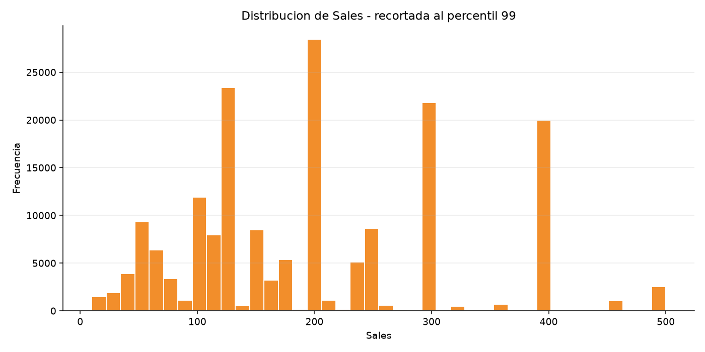

### Descuento vs ventas

Busca si el descuento parece relacionarse con ventas; no implica causalidad.

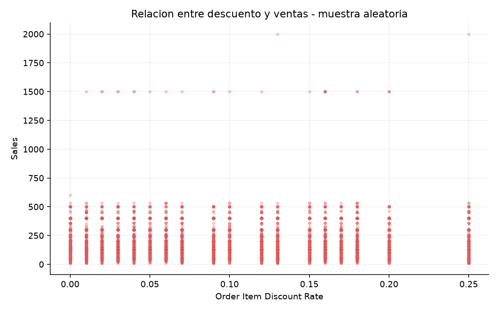

### Correlacion con Sales

Ranking rapido de variables numericas potencialmente utiles para ventas; no reemplaza validacion.

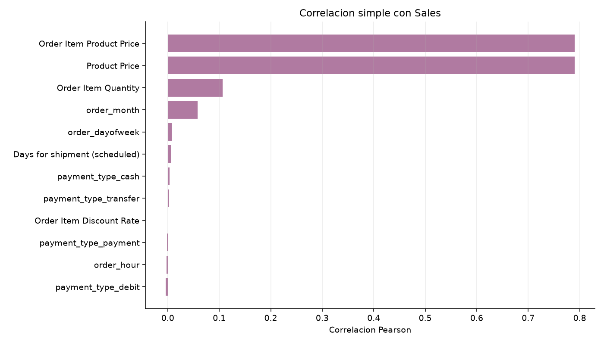

### Correlacion con retraso

Ranking rapido para el target logistico, cuidando leakage.

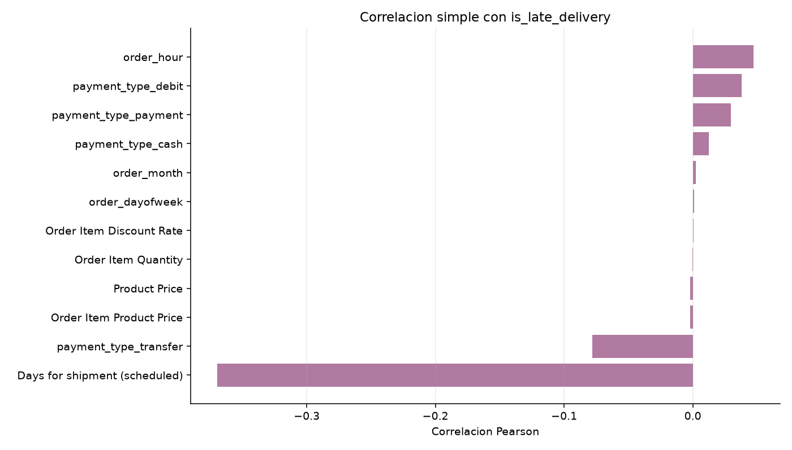

### Visitas por departamento

Los logs pueden aportar senal de interes/demanda por departamento.

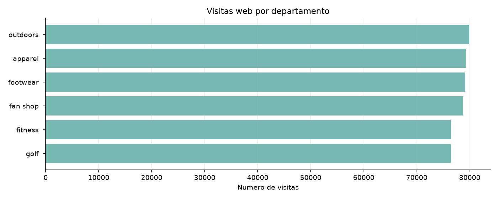

### Visitas por categoria

Compara interes web con categorias de venta.

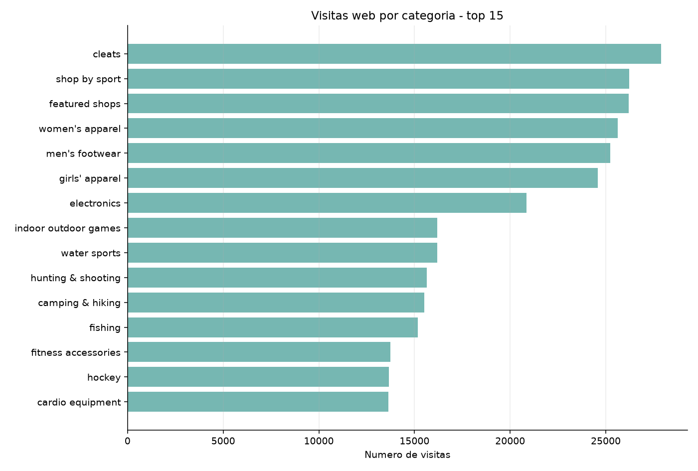

### Visitas por hora

Puede aportar patrones temporales de demanda o actividad.

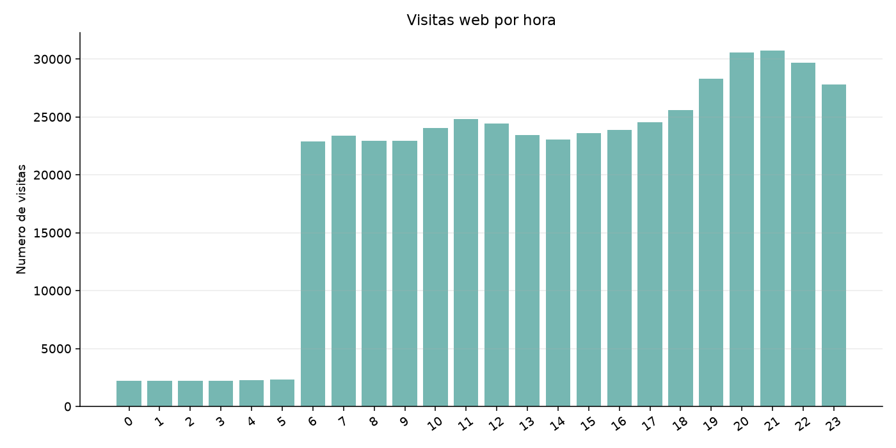

### Ventas vs visitas web

Compara demanda comprada frente a interes web; util para features de demanda si se alinea temporalmente.

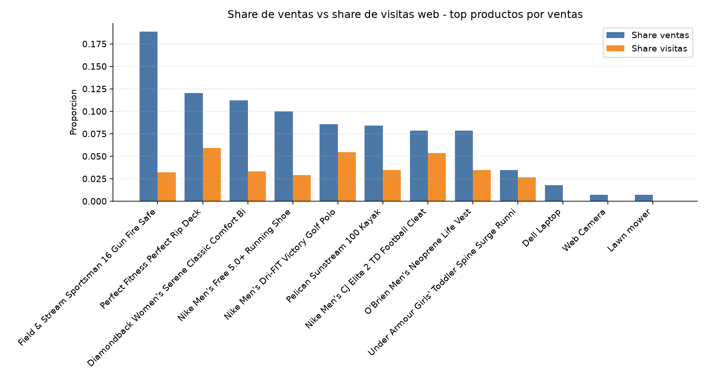