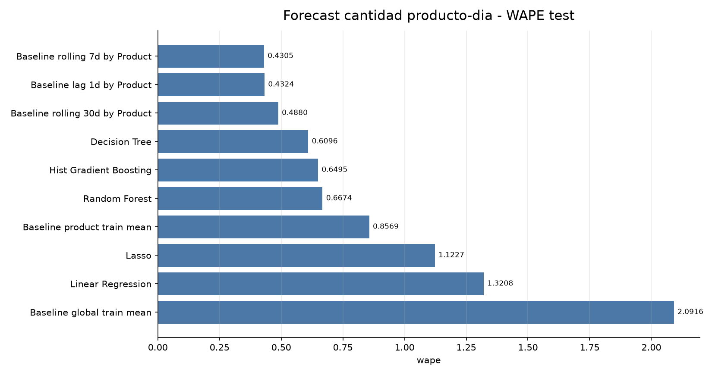
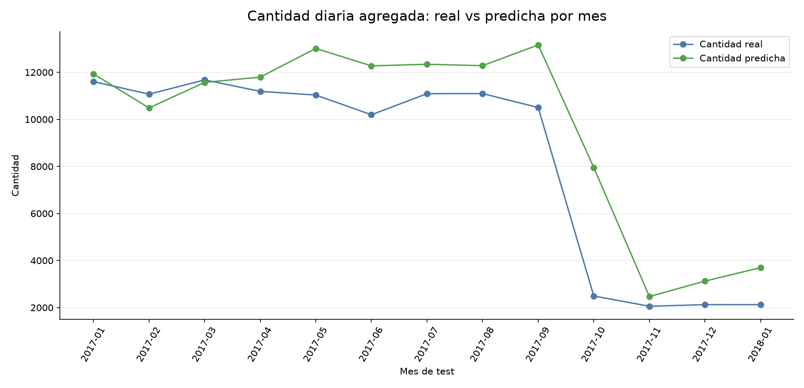
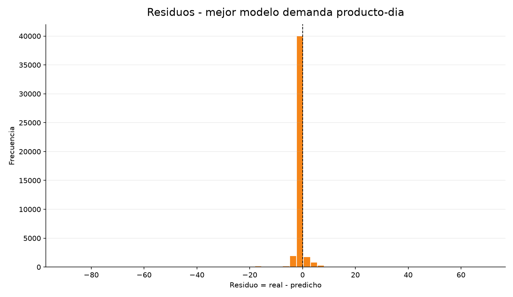

```{r setup, include=FALSE}
knitr::opts_chunk$set(echo = FALSE, warning = FALSE, message = FALSE)
```

# Forecast de Cantidad Vendida

## Objetivo

El objetivo es predecir `Order Item Quantity` agregada por `Product Name` y dia para apoyar la planificacion diaria de demanda.

El dataset de modelado incluye todos los productos en todos los dias del rango historico. Si un producto no vendio en un dia, su target es `0`. Esto hace que el problema sea demanda diaria real, no solo prediccion sobre dias donde ya sabemos que hubo venta.

---

# 1. Validez Temporal

| check | estado | lectura |
| --- | --- | --- |
| target | quantity_sold | Cantidad diaria por producto; incluye ceros producto-dia |
| split | train < 2017-01-01, test >= 2017-01-01 | Temporal, sin mezcla aleatoria |
| same_day_quantity | excluida | La cantidad del dia predicho no entra como variable |
| same_day_price_discount_sales | excluidas | Las variables del dia predicho no se usan |
| history_features | 63 | Lags/rollings desplazados por producto, categoria y global |
| rolling_shift | shift(1) | Los rollings usan informacion anterior al dia predicho |
| raw_data | intactos | Solo se generan salidas derivadas en data/processed y reports |

Lectura: las variables del dia predicho quedan fuera. El modelo utiliza historicos desplazados y datos disponibles antes de la fecha de estimacion.

---

# 2. Resultado General

Mejor resultado global en test: `Baseline rolling 7d by Product`.

Mejor modelo ML en test: `Decision Tree`.

| metrica | valor |
| --- | ---: |
| MAE ganador global | 0.9972 |
| RMSE ganador global | 4.3736 |
| R2 ganador global | 0.8207 |
| WAPE ganador global | 0.4305 |
| MAE mejor ML | 1.4122 |
| RMSE mejor ML | 4.8393 |
| R2 mejor ML | 0.7805 |
| WAPE mejor ML | 0.6096 |

El mejor modelo ML queda 0.4150 puntos de MAE por encima del mejor baseline historico, equivalente a 41.61% mas error. Por tanto, en esta primera version los modelos complejos no superan a una regla historica simple.

---

# 3. Comparacion de Modelos

| model | mae | mse | rmse | r2 | wape | mape_nonzero_actual | train_seconds |
| --- | --- | --- | --- | --- | --- | --- | --- |
| Baseline rolling 7d by Product | 0.9972 | 19.1287 | 4.3736 | 0.8207 | 0.4305 | 0.5096 |  |
| Baseline lag 1d by Product | 1.0017 | 18.9904 | 4.3578 | 0.822 | 0.4324 | 0.6753 |  |
| Baseline rolling 30d by Product | 1.1305 | 21.6417 | 4.6521 | 0.7971 | 0.488 | 0.4919 |  |
| Decision Tree | 1.4122 | 23.419 | 4.8393 | 0.7805 | 0.6096 | 0.5961 | 4.8497 |
| Hist Gradient Boosting | 1.5045 | 20.0915 | 4.4824 | 0.8117 | 0.6495 | 0.4177 | 6.01 |
| Random Forest | 1.5462 | 19.9948 | 4.4716 | 0.8126 | 0.6674 | 0.6682 | 16.6865 |
| Baseline product train mean | 1.9851 | 60.5515 | 7.7815 | 0.4324 | 0.8569 | 0.5908 |  |
| Lasso | 2.6007 | 34.6807 | 5.889 | 0.6749 | 1.1227 | 0.4904 | 85.2385 |
| Linear Regression | 3.0598 | 69.6285 | 8.3444 | 0.3473 | 1.3208 | 0.553 | 23.8895 |
| Baseline global train mean | 4.8452 | 107.4489 | 10.3658 | -0.0073 | 2.0916 | 0.9563 |  |


## MAE en test


**Lectura:** Compara el error absoluto medio por producto-dia. Menor es mejor.


## WAPE en test



**Lectura:** Mide el error total relativo a la cantidad real vendida.


## Cantidad real vs predicha por mes



**Lectura:** Comprueba si el mejor modelo ML sigue el volumen agregado mensual de unidades. El ganador global por MAE sigue siendo el baseline rolling 7d.


## Residuos del mejor modelo ML



**Lectura:** Permite ver sesgo y dispersion de errores producto-dia.


---

# 4. Importancia de Variables

| model | feature | importance | raw_value |
| --- | --- | --- | --- |
| Decision Tree | numeric__product_quantity_sold_roll_mean_30d | 0.8127296952085115 | 0.8127296952085115 |
| Decision Tree | numeric__category_quantity_sold_roll_mean_30d | 0.07331108564269236 | 0.07331108564269236 |
| Decision Tree | numeric__product_sales_sum_roll_mean_7d | 0.06861744813180745 | 0.06861744813180745 |
| Decision Tree | numeric__product_avg_discount_roll_mean_30d | 0.011119596891577382 | 0.011119596891577382 |
| Decision Tree | numeric__product_quantity_sold_roll_sum_30d | 0.002011355001052756 | 0.002011355001052756 |
| Decision Tree | numeric__product_avg_discount_rate_lag_7d | 0.0018384672069592504 | 0.0018384672069592504 |
| Decision Tree | numeric__global_quantity_sold_lag_1d | 0.0014348755393704066 | 0.0014348755393704066 |
| Decision Tree | numeric__global_quantity_sold_lag_7d | 0.0013120791167514191 | 0.0013120791167514191 |
| Decision Tree | numeric__order_day | 0.0012401991579194527 | 0.0012401991579194527 |
| Decision Tree | numeric__product_avg_discount_lag_7d | 0.0011977372431529643 | 0.0011977372431529643 |
| Decision Tree | numeric__product_avg_discount_rate_lag_1d | 0.0011569779560430954 | 0.0011569779560430954 |
| Decision Tree | numeric__global_quantity_sold_roll_mean_30d | 0.0011433271860057472 | 0.0011433271860057472 |
| Decision Tree | numeric__product_avg_discount_lag_1d | 0.0010715815293978743 | 0.0010715815293978743 |
| Decision Tree | numeric__category_sales_sum_roll_mean_30d | 0.0010020724330880983 | 0.0010020724330880983 |
| Decision Tree | numeric__product_avg_discount_rate_lag_30d | 0.0009468627620945131 | 0.0009468627620945131 |
| Decision Tree | numeric__product_avg_discount_roll_mean_7d | 0.0009345373892854789 | 0.0009345373892854789 |
| Decision Tree | numeric__product_avg_discount_roll_sum_30d | 0.0009000107429425022 | 0.0009000107429425022 |
| Decision Tree | numeric__global_quantity_sold_lag_30d | 0.0008858586536850963 | 0.0008858586536850963 |
| Decision Tree | numeric__product_avg_price_lag_7d | 0.0007852260554531167 | 0.0007852260554531167 |
| Decision Tree | numeric__category_sales_sum_lag_7d | 0.0007817189497175247 | 0.0007817189497175247 |
| Decision Tree | numeric__order_dayofyear | 0.000767111381852241 | 0.000767111381852241 |
| Decision Tree | numeric__product_avg_discount_rate_roll_mean_7d | 0.0007402823003775316 | 0.0007402823003775316 |
| Decision Tree | numeric__global_quantity_sold_roll_mean_7d | 0.0007031447497393504 | 0.0007031447497393504 |
| Decision Tree | numeric__category_quantity_sold_lag_30d | 0.0007017240891250727 | 0.0007017240891250727 |
| Decision Tree | numeric__product_avg_discount_rate_roll_mean_30d | 0.0006830545371467648 | 0.0006830545371467648 |

Lectura: las variables relevantes son historicos de demanda, calendario y atributos de producto o categoria disponibles antes de la fecha de estimacion.

---

# 5. Conclusion

La conclusion honesta de esta prueba es que los modelos complejos no superan al baseline rolling 7d por producto. Con los datos actuales, la regla historica simple es la referencia a usar. El siguiente paso no es vender un modelo complejo, sino mejorar el planteamiento: probar agregacion semanal, forecast por categoria/producto importante, variables externas o senales comerciales planificadas.
