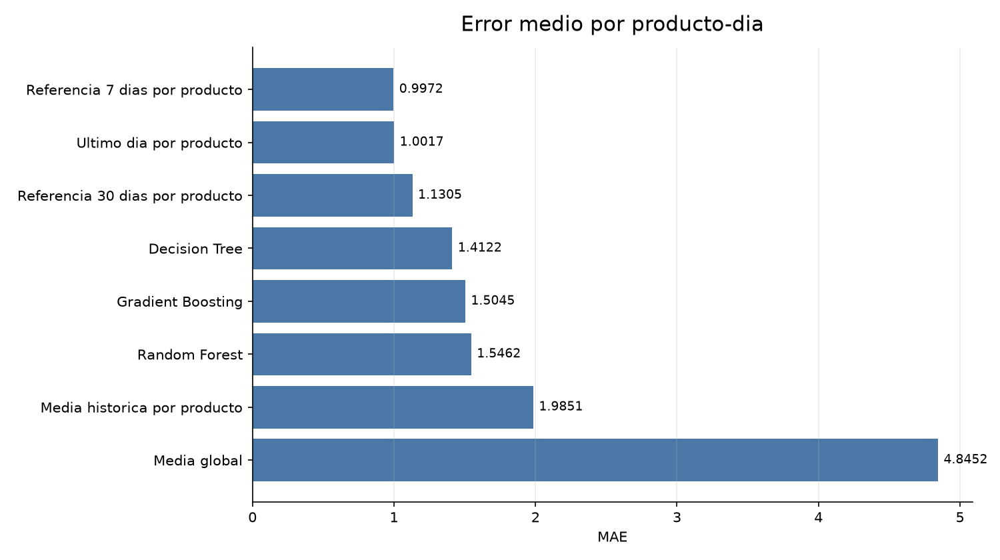
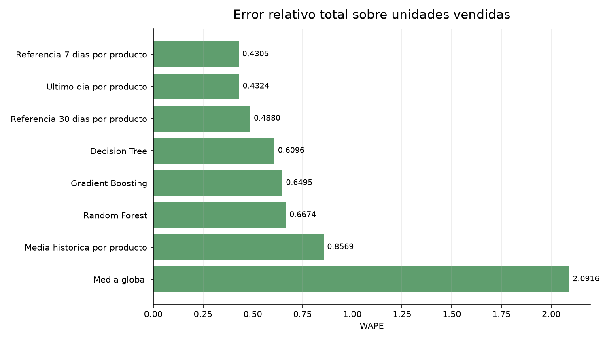
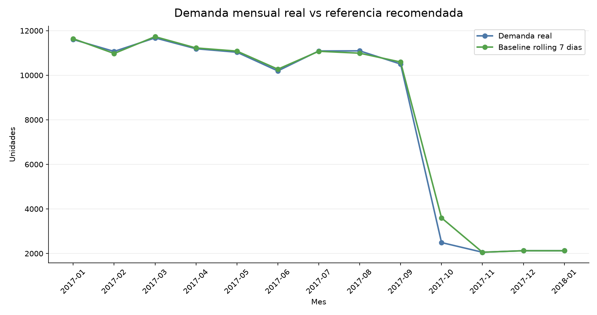

```{r setup, include=FALSE}
knitr::opts_chunk$set(echo = FALSE, warning = FALSE, message = FALSE)
```

<div align="center">

# Recomendacion de Demanda DataCo

## Usar una referencia historica simple por producto

**Recomendacion principal:** usar una referencia de demanda basada en el rolling de los ultimos 7 dias por producto como punto de partida operativo. Los modelos de machine learning probados no superan esta regla simple, por lo que no deberian ser la primera solucion para planificar unidades diarias.

</div>

---

# 1. Resumen Ejecutivo

El objetivo comercial es anticipar cuantas unidades se venderan por producto y dia para mejorar la planificacion.

La comparacion muestra que la mejor referencia actual no es un modelo complejo, sino una regla historica simple: el promedio movil de los ultimos 7 dias por producto.

La empresa deberia usar esta referencia como baseline operativo, medir su rendimiento por producto/categoria y solo avanzar a modelos mas complejos cuando existan senales adicionales que no estan hoy en el dataset: stock, promociones planificadas, campanas, precio futuro real, visitas web futuras o calendario comercial detallado.

---

# 2. Decision Comercial

Comparacion de alternativas principales:

| Sistema | MAE | RMSE | R2 | WAPE | Lectura comercial |
| --- | --- | --- | --- | --- | --- |
| Referencia 7 dias por producto | 0.9972 | 4.3736 | 0.8207 | 0.4305 | Mejor opcion: simple, estable y facil de mantener |
| Mejor modelo ML | 1.4122 | 4.8393 | 0.7805 | 0.6096 | No mejora al baseline; agrega complejidad sin beneficio |
| Media historica por producto | 1.9851 | 7.7815 | 0.4324 | 0.8569 | Demasiado lenta para cambios recientes de demanda |

El mejor modelo ML queda **0.4149 unidades de MAE** por encima del baseline recomendado. Esto equivale a **41.6% mas error** por producto-dia.

## Grafico 1. Error medio por producto-dia



**Lectura:** la referencia historica de 7 dias por producto es la opcion con menor error. Los modelos complejos quedan por detras.

---

# 3. Error Relativo Sobre Unidades Vendidas

El WAPE permite ver el error total frente al volumen real de unidades vendidas. Tambien aqui gana la referencia de 7 dias por producto.

| Sistema | WAPE | Lectura comercial |
| --- | ---: | --- |
| Referencia 7 dias por producto | 0.4305 | Mejor equilibrio entre precision y simplicidad |
| Mejor modelo ML | 0.6096 | Peor error relativo y mayor complejidad |
| Media historica por producto | 0.8569 | No reacciona suficiente a cambios recientes |

## Grafico 2. Error relativo total



**Lectura:** el baseline recomendado no solo gana en MAE; tambien gana al medir el error relativo total sobre unidades vendidas.

---

# 4. Comportamiento Mensual

En el periodo de test, la demanda real suma **108,247 unidades**. La referencia rolling 7 dias estima **109,490 unidades**, una diferencia agregada de **1,243 unidades** (1.1%).

## Grafico 3. Demanda mensual real vs referencia recomendada



**Lectura:** la referencia historica sigue el nivel general de demanda. La caida del final del dataset tambien aparece en la prediccion porque el rolling recoge cambios recientes.

---

# 5. Prioridad Operativa

La empresa deberia tratar este resultado como una decision de control y planificacion, no como una demostracion de que un modelo complejo ya aporta valor.

| Prioridad | Accion | Motivo |
| --- | --- | --- |
| 1 | Adoptar rolling 7 dias por producto como referencia base | Es la opcion mas precisa y facil de mantener |
| 2 | Medir errores por producto y categoria | La demanda no falla igual en todos los productos |
| 3 | Probar agregacion semanal | Puede reducir ruido diario y mejorar la utilidad operativa |
| 4 | Incorporar senales reales de negocio | Stock, promociones, campanas, precio futuro y trafico web futuro |
| 5 | Reentrenar modelos solo si superan al baseline | La complejidad debe justificarse con mejora medible |

---

# 6. Decision Final

La recomendacion final es usar **rolling 7 dias por producto** como referencia inicial para planificar demanda diaria.

Esta opcion permite:

- trabajar directamente con unidades vendidas por producto y dia;
- utilizar exclusivamente informacion disponible antes de cada prediccion;
- usar una regla transparente para operaciones y negocio;
- superar a los modelos ML probados en MAE y WAPE;
- mantener una base clara para futuras mejoras.

Los modelos complejos quedan como una segunda fase. Para que tengan sentido, el dataset necesita senales que expliquen cambios futuros de demanda, no solo historicos internos.
