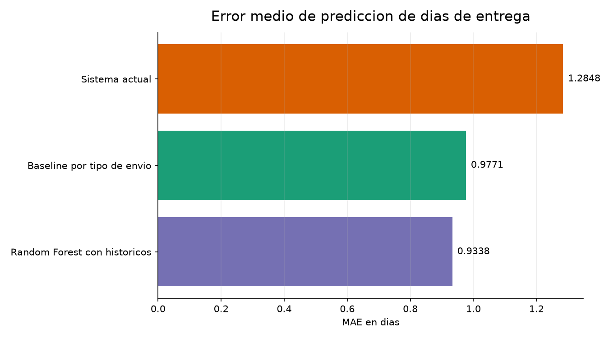
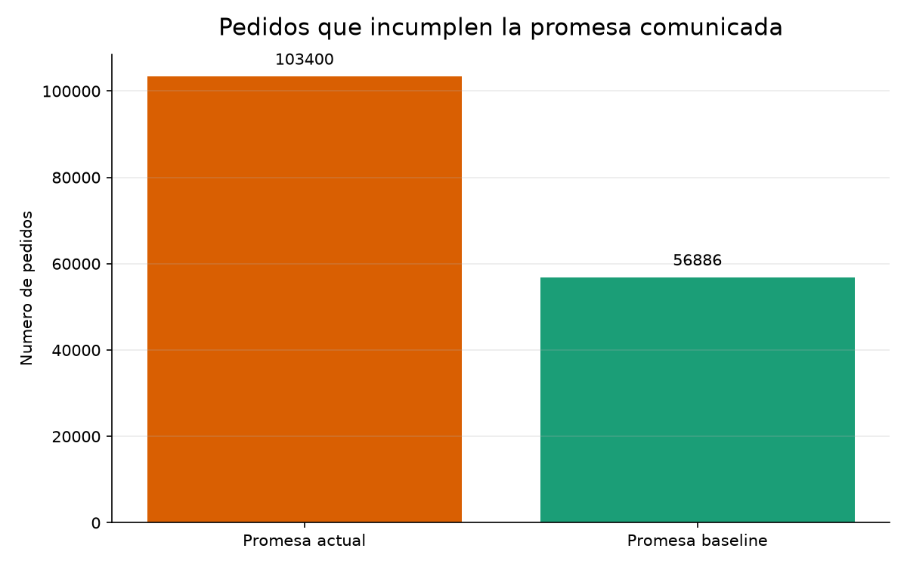
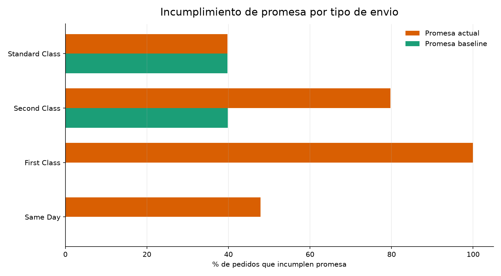

---
title: "Recomendacion de Envios DataCo"
subtitle: "Actualizacion de promesas de entrega por tipo de envio"
author: "Proyecto DataCo"
date: "2026-07-05"
output:
  html_document:
    toc: true
    toc_depth: 2
    number_sections: true
    theme: readable
    df_print: paged
---

```{r setup, include=FALSE}
knitr::opts_chunk$set(echo = FALSE, warning = FALSE, message = FALSE)
```

<div align="center">

# Recomendacion de Envios DataCo

## Actualizar la promesa base por tipo de envio

**Recomendacion principal:** actualizar los dias prometidos al cliente por `Shipping Mode` y priorizar la mejora operativa de los envios que mas incumplen. Un modelo predictivo aporta una mejora adicional pequena frente a esta regla simple, por lo que no deberia ser la primera iniciativa.

</div>

---

# 1. Resumen Ejecutivo

El sistema actual promete plazos demasiado optimistas. Esto genera un volumen alto de pedidos que incumplen el plazo comunicado al cliente, especialmente en `First Class` y `Second Class`.

El analisis compara tres alternativas:

1. Mantener la promesa actual.
2. Actualizar una promesa base por tipo de envio.
3. Usar un modelo Random Forest con historicos recientes por tipo de envio.

La opcion mas recomendable es actualizar la promesa base por tipo de envio. Reduce de forma clara el error y las promesas incumplidas, con una implementacion simple, transparente y facil de mantener.

El modelo Random Forest mejora ligeramente la precision, pero no resuelve el problema principal: los envios siguen tardando lo mismo. La prioridad debe ser ajustar la promesa al cliente y mejorar la operacion logistica.

---

# 2. Impacto Comercial de Cambiar la Promesa Base

Comparacion de error medio en dias:

| Sistema | MAE en dias | Lectura comercial |
| --- | ---: | --- |
| Sistema actual | 1.2848 | La promesa actual esta mal calibrada |
| Promesa base por tipo de envio | 0.9771 | Baja el error en 0.3077 dias, unas 7.4 horas por pedido |
| Random Forest con historicos | 0.9338 | Mejora solo 0.0433 dias frente a la promesa base |

La promesa base por tipo de envio reduce el error frente al sistema actual en aproximadamente **24%**.

El Random Forest con historicos mejora alrededor de **4.4%** frente a la promesa base. La diferencia equivale aproximadamente a **1 hora** de error medio por pedido, una mejora limitada para el coste de mantener un modelo.

## Grafico 1. Error medio de prediccion



**Lectura:** la mejora relevante aparece al pasar del sistema actual a una promesa base por tipo de envio. El modelo reduce algo mas el error, pero el beneficio adicional es pequeno.

---

# 3. Promesas Incumplidas

Actualizar la promesa base no hace que los paquetes lleguen antes. Lo que cambia es que la empresa deja de comunicar plazos que sus envios actuales no cumplen.

Con la promesa actual:

- **103.400 pedidos** incumplen el plazo prometido.
- Esto supone el **57.3%** de los pedidos analizados.

Con una promesa base por tipo de envio:

- **56.886 pedidos** incumplirian la nueva promesa.
- Esto supone el **31.5%** de los pedidos analizados.

Impacto comercial:

- **46.514 pedidos** dejarian de incumplir la promesa comunicada.
- Las promesas incumplidas bajarian aproximadamente **45.0%**.
- El cumplimiento de promesa subiria de **42.7%** a **68.5%**, una mejora de **25.8 puntos porcentuales**.

## Grafico 2. Pedidos que incumplen la promesa



**Lectura:** una promesa mas realista reduce el volumen de incumplimientos comunicados al cliente y mejora la fiabilidad percibida del servicio.

---

# 4. Recomendacion por Tipo de Envio

Promesa base recomendada usando el comportamiento medio real de cada tipo de envio:

| Tipo de envio | Pedidos | Promesa actual | Dias reales medios | Nueva promesa base | Incumplen hoy | Incumplirian nueva promesa | Pedidos corregidos |
| --- | ---: | ---: | ---: | ---: | ---: | ---: | ---: |
| First Class | 27.814 | 1 dia | 2.00 dias | 2 dias | 27.814 | 0 | 27.814 |
| Same Day | 9.737 | 0 dias | 0.48 dias | 1 dia | 4.657 | 0 | 4.657 |
| Second Class | 35.216 | 2 dias | 3.99 dias | 4 dias | 28.078 | 14.035 | 14.043 |
| Standard Class | 107.752 | 4 dias | 4.00 dias | 4 dias | 42.851 | 42.851 | 0 |

## Grafico 3. Incumplimiento por tipo de envio



**Lectura:** `First Class` y `Second Class` estan claramente sobreprometidos. `Standard Class` ya promete 4 dias, pero aun concentra muchos pedidos por encima de ese plazo; en ese caso el problema es operativo, no solo de prediccion.

---

# 5. Valor del Modelo Predictivo

El mejor modelo probado fue Random Forest con historicos por tipo de envio.

| Metodo | MAE | RMSE | R2 | WAPE | MAPE |
| --- | ---: | ---: | ---: | ---: | ---: |
| Random Forest con historicos | 0.9338 | 1.2491 | 0.4025 | 0.2671 | 0.2932 |
| Promesa base por tipo de envio | 0.9771 | 1.2642 | 0.3879 | 0.2795 | 0.3203 |

El modelo mejora la precision, pero el margen adicional es reducido:

- Mejora **0.0433 dias** de MAE frente a la promesa base.
- Equivale aproximadamente a **1 hora** de error medio por pedido.
- Requiere entrenamiento, mantenimiento, validacion y seguimiento.
- No reduce por si mismo el tiempo real de entrega.

Por este motivo, el modelo puede considerarse una mejora analitica posterior, pero la accion inicial con mayor impacto y menor complejidad es actualizar la promesa base por tipo de envio.

---

# 6. Prioridad Operativa

Actualizar la promesa es necesario, pero no suficiente.

Hay dos problemas distintos:

1. **Promesa al cliente:** se estan comunicando plazos inferiores al comportamiento real de algunos envios.
2. **Operacion logistica:** muchos pedidos siguen llegando mas tarde de lo deseable, incluso cuando la promesa se vuelve mas realista.

Prioridades recomendadas:

| Prioridad | Accion | Motivo |
| --- | --- | --- |
| 1 | Recalibrar promesas por `Shipping Mode` | Reduce rapidamente promesas incumplidas y mejora la comunicacion al cliente |
| 2 | Revisar `First Class` y `Second Class` | Son los modos donde la promesa actual esta mas lejos de la realidad |
| 3 | Analizar `Standard Class` operativamente | Ya promete 4 dias, pero aun concentra muchos incumplimientos |
| 4 | Incorporar datos operativos adicionales | Para reducir retrasos reales hacen falta transportista, almacen, distancia, capacidad, stock, festivos e incidencias |
| 5 | Mantener el modelo como mejora posterior | Su ganancia frente a la promesa base es limitada |

---

# 7. Decision Final

La recomendacion final es implantar una **promesa base por `Shipping Mode`** como nueva referencia operativa y comercial.

Esta accion permite:

- reducir el error medio de prediccion en aproximadamente **24%** frente al sistema actual;
- bajar las promesas incumplidas de **103.400** a **56.886** pedidos;
- mejorar el cumplimiento comunicado al cliente de **42.7%** a **68.5%**;
- mantener una solucion simple, explicable y facil de actualizar.

El modelo Random Forest queda como una opcion secundaria. Su mejora frente a la promesa base existe, pero no compensa como primera iniciativa. Para mejorar de verdad la experiencia de entrega, la empresa debe corregir los procesos que provocan retrasos reales, no solo anticiparlos mejor.

