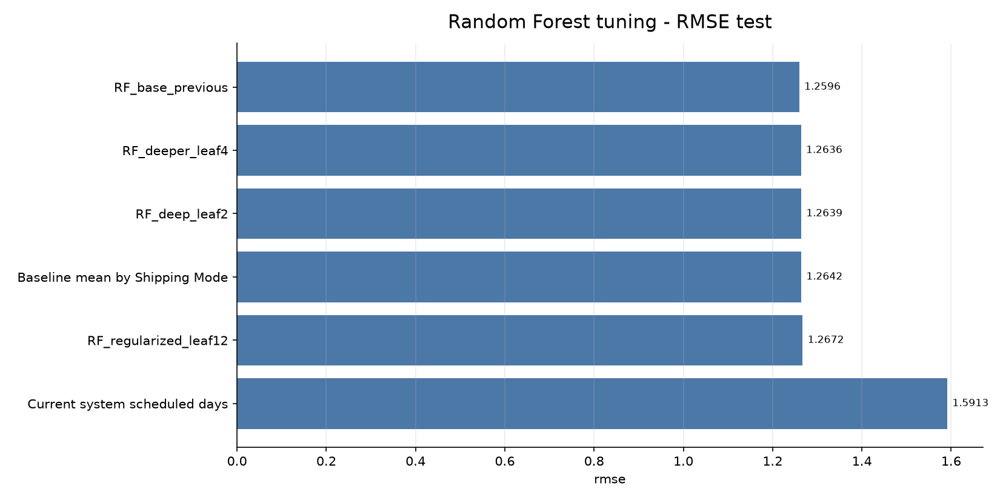
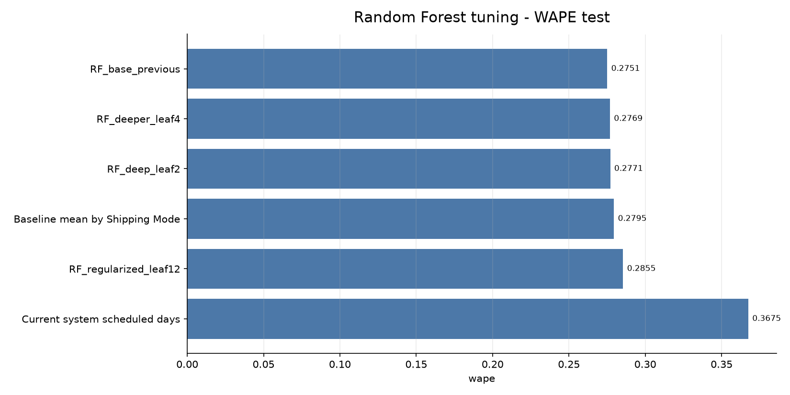
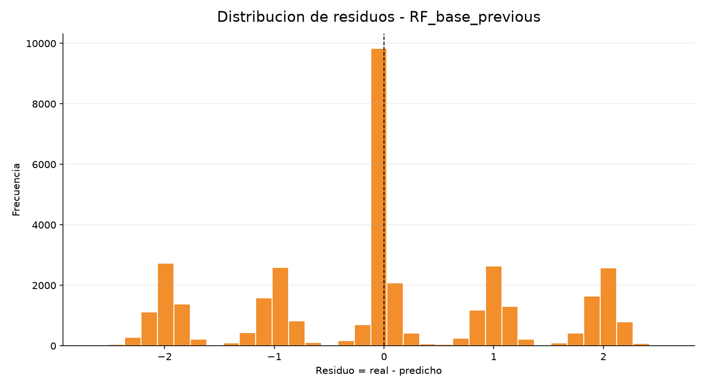
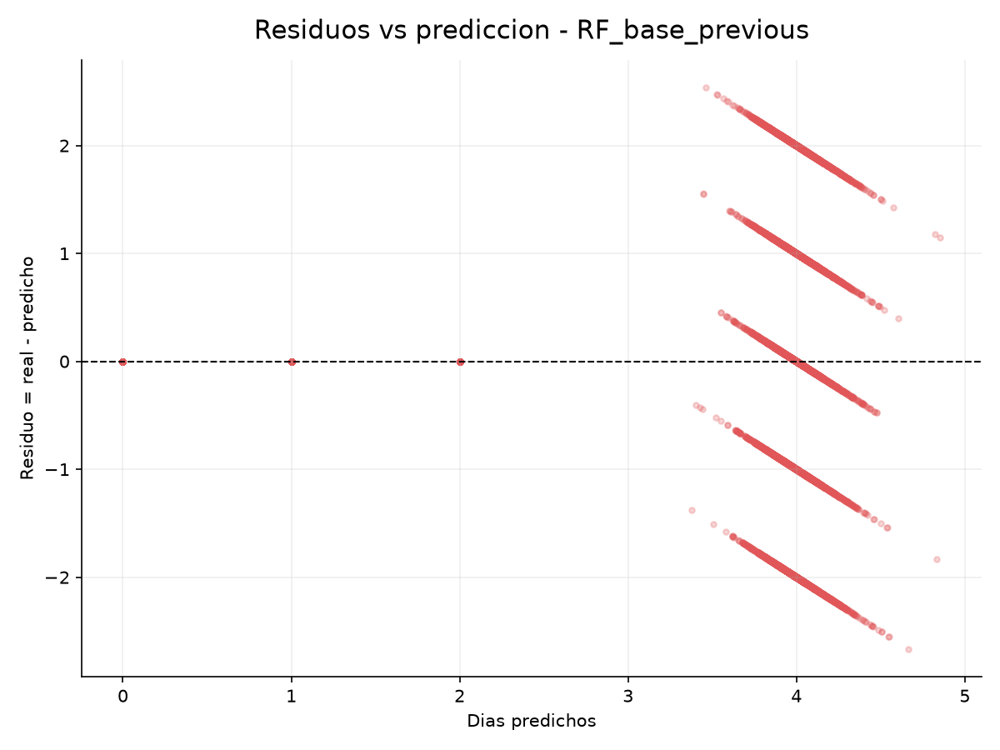
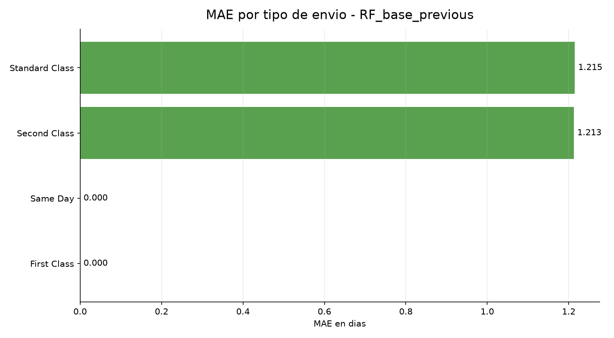
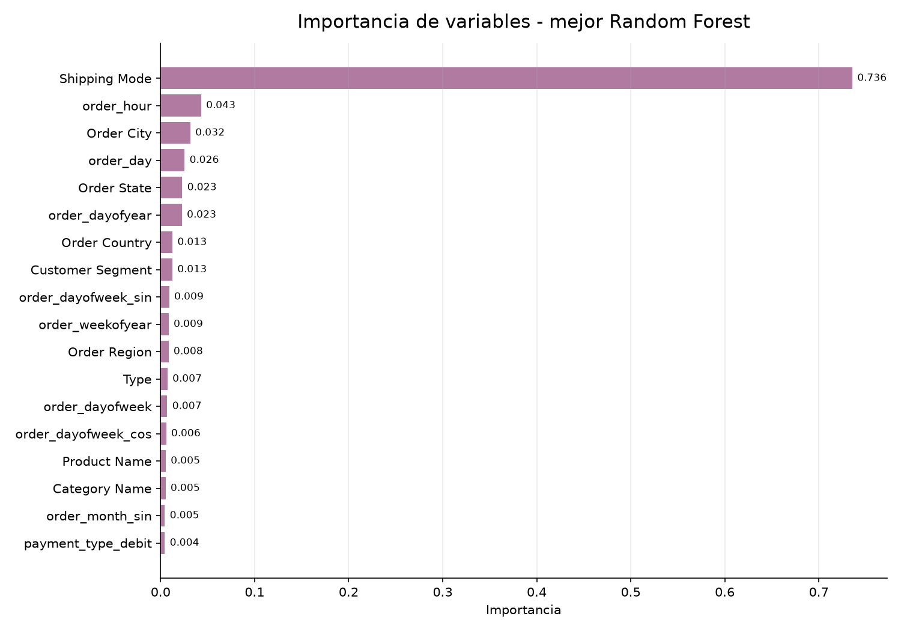

---
title: "Random Forest para Prediccion de Llegada"
subtitle: "Tuning, metricas completas y residuos"
author: "Proyecto DataCo"
date: "2026-07-05"
output:
  html_document:
    toc: true
    toc_depth: 2
    number_sections: true
    theme: readable
    df_print: paged
---

```{r setup, include=FALSE}
knitr::opts_chunk$set(echo = FALSE, warning = FALSE, message = FALSE)
```

<div align="center">

# Random Forest para Prediccion de Llegada

## DataCo Supply Chain

**Objetivo:** pulir Random Forest, comparar hiperparametros y analizar residuos sin usar fecha real de llegada/envio como leakage.

</div>

---

# 1. Resumen Ejecutivo

El mejor Random Forest en test fue `RF_base_previous`.

| Comparacion | MAE | RMSE | R2 | WAPE | MAPE sin dias 0 |
| --- | ---: | ---: | ---: | ---: | ---: |
| Mejor Random Forest | 0.9617 | 1.2596 | 0.3923 | 0.2751 | 0.3073 |
| Sistema actual | 1.2848 | 1.5913 | 0.0302 | 0.3675 | 0.4214 |
| Baseline por Shipping Mode | 0.9771 | 1.2642 | 0.3879 | 0.2795 | 0.3203 |

La mejora frente al sistema actual es clara, pero la mejora frente al baseline por `Shipping Mode` sigue siendo pequena. Esto confirma que gran parte de la senal esta en el tipo de envio.

---

# 2. Fecha Usada y Leakage

Se agregaron variables derivadas de la **fecha del pedido**:

- `order_year`, `order_month`, `order_day`, `order_dayofweek`, `order_dayofyear`, `order_weekofyear`, `order_quarter`, `order_hour`, `order_is_weekend`.
- variables ciclicas: `order_month_sin`, `order_month_cos`, `order_dayofweek_sin`, `order_dayofweek_cos`.

No se uso la fecha real de envio/llegada (`shipping_datetime`, `shipping_month`, `shipping_dayofweek`, `shipping_hour`) porque eso filtra el resultado.

Features usadas:

| feature |
| --- |
| Shipping Mode |
| Order Country |
| Order Region |
| Order State |
| Order City |
| Market |
| Customer Segment |
| Category Name |
| Department Name |
| Product Name |
| Type |
| Order Item Quantity |
| order_year |
| order_month |
| order_day |
| order_dayofweek |
| order_dayofyear |
| order_weekofyear |
| order_quarter |
| order_hour |
| order_is_weekend |
| order_month_sin |
| order_month_cos |
| order_dayofweek_sin |
| order_dayofweek_cos |
| payment_type_cash |
| payment_type_debit |
| payment_type_payment |
| payment_type_transfer |

Variables evitadas por leakage:

| leakage_feature |
| --- |
| Delivery Status |
| Late_delivery_risk |
| is_late_delivery |
| shipping date (DateOrders) |
| shipping_datetime |
| shipping_month |
| shipping_dayofweek |
| shipping_hour |
| Days for shipping (real) |
| shipping_hours_from_dates |
| shipping_days_from_dates_exact |
| shipping_days_from_dates_floor |

---

# 3. Hiperparametros Probados

| model | n_estimators | max_depth | min_samples_leaf | min_samples_split | max_features | bootstrap |
| --- | --- | --- | --- | --- | --- | --- |
| RF_base_previous | 120 | 18 | 8 | 16 | 1.0 | True |
| RF_deeper_leaf4 | 180 | 26 | 4 | 10 | 0.8 | True |
| RF_regularized_leaf12 | 180 | 16 | 12 | 24 | sqrt | True |
| RF_deep_leaf2 | 220 | 30 | 2 | 6 | 0.7 | True |

---

# 4. Resultados Completos

MAPE se calcula excluyendo filas donde el valor real es 0 dias, porque dividir entre 0 no es valido. WAPE se calcula como `sum(abs(error)) / sum(abs(real))`.

| model | split | mae | mse | rmse | r2 | wape | mape_nonzero_actual | residual_mean | residual_median | residual_std | train_seconds |
| --- | --- | --- | --- | --- | --- | --- | --- | --- | --- | --- | --- |
| RF_base_previous | test | 0.9617 | 1.5866 | 1.2596 | 0.3923 | 0.2751 | 0.3073 | -0.0059 | 0.0 | 1.2596 | 23.4117 |
| RF_deeper_leaf4 | test | 0.9679 | 1.5966 | 1.2636 | 0.3885 | 0.2769 | 0.3092 | -0.0108 | 0.0 | 1.2635 | 39.1612 |
| RF_deep_leaf2 | test | 0.9686 | 1.5975 | 1.2639 | 0.3882 | 0.2771 | 0.3093 | -0.0102 | 0.0 | 1.2639 | 44.5363 |
| Baseline mean by Shipping Mode | test | 0.9771 | 1.5981 | 1.2642 | 0.3879 | 0.2795 | 0.3203 | -0.0016 | 0.0031 | 1.2642 | 0.0 |
| RF_regularized_leaf12 | test | 0.998 | 1.6058 | 1.2672 | 0.385 | 0.2855 | 0.3197 | -0.0157 | -0.0256 | 1.2671 | 9.3546 |
| Current system scheduled days | test | 1.2848 | 2.5322 | 1.5913 | 0.0302 | 0.3675 | 0.4214 | 0.5642 | 1.0 | 1.4879 | 0.0 |
| RF_deep_leaf2 | train | 0.3517 | 0.2511 | 0.5011 | 0.905 | 0.1005 | 0.112 | 0.0004 | 0.0 | 0.5011 | 44.5363 |
| RF_deeper_leaf4 | train | 0.5189 | 0.5009 | 0.7078 | 0.8105 | 0.1483 | 0.1656 | 0.0003 | 0.0 | 0.7078 | 39.1612 |
| RF_base_previous | train | 0.7907 | 1.0937 | 1.0458 | 0.5862 | 0.226 | 0.2527 | 0.0005 | 0.0 | 1.0458 | 23.4117 |
| RF_regularized_leaf12 | train | 0.9033 | 1.3314 | 1.1538 | 0.4962 | 0.2582 | 0.287 | 0.0001 | -0.0182 | 1.1538 | 9.3546 |

## Grafico 1. MAE en test


**Lectura:** MAE es la metrica principal: error medio absoluto en dias.


---

## Grafico 2. RMSE en test



**Lectura:** RMSE penaliza errores grandes. Si sube mucho frente a MAE, hay pedidos donde el modelo falla mas fuerte.


---

## Grafico 3. WAPE en test



**Lectura:** WAPE expresa el error absoluto total frente al total de dias reales. Es util para resumir error relativo global.


---

# 5. Residuos del Mejor Random Forest

Residuo definido como:

```text
residuo = dias reales - dias predichos
```

Si el residuo es positivo, el modelo predijo menos dias de los reales. Si es negativo, predijo demasiados dias.

Resumen por tipo de envio:

| Shipping Mode | rows | mae | residual_mean | residual_median |
| --- | --- | --- | --- | --- |
| First Class | 5550 | 0.0 | 0.0 | 0.0 |
| Same Day | 1959 | 0.0 | 0.0 | 0.0 |
| Second Class | 7041 | 1.2126 | -0.0101 | 0.0176 |
| Standard Class | 21554 | 1.2148 | -0.0066 | 0.0038 |

## Grafico 4. Histograma de residuos



**Lectura:** Permite ver si el modelo tiende a equivocarse hacia arriba o hacia abajo.


---

## Grafico 5. Residuos vs prediccion



**Lectura:** Busca patrones: si los residuos no son aleatorios, todavia faltan variables o reglas por capturar.


---

## Grafico 6. MAE por tipo de envio



**Lectura:** Muestra donde el modelo sigue fallando mas despues del tuning.


---

# 6. Importancia de Variables

| feature | importance |
| --- | --- |
| Shipping Mode | 0.7356 |
| order_hour | 0.0431 |
| Order City | 0.0317 |
| order_day | 0.0255 |
| Order State | 0.023 |
| order_dayofyear | 0.0226 |
| Order Country | 0.0126 |
| Customer Segment | 0.0125 |
| order_dayofweek_sin | 0.0092 |
| order_weekofyear | 0.0086 |
| Order Region | 0.0085 |
| Type | 0.0074 |
| order_dayofweek | 0.0071 |
| order_dayofweek_cos | 0.0059 |
| Product Name | 0.0055 |
| Category Name | 0.0053 |
| order_month_sin | 0.0045 |
| payment_type_debit | 0.0045 |

## Grafico 7. Importancia de variables



**Lectura:** La importancia confirma si `Shipping Mode` domina o si pais, ciudad y fecha del pedido aportan senal adicional.


---

# 7. Lags y Rollings Propuestos

Tiene sentido probar lags y rolling features, pero deben construirse con cuidado para evitar leakage. No deben usar informacion futura respecto al pedido que se quiere predecir.

Propuesta para una siguiente iteracion:

1. Ordenar pedidos por `order_datetime`.
2. Crear historicos por grupos como `Shipping Mode`, `Order Country`, `Order City`, `Order Region`, `Category Name`.
3. Para cada grupo, calcular features con `shift(1)` antes del rolling:
   - media historica de `Days for shipping (real)` ultimos 7/30/90 dias;
   - tasa historica de promesa incumplida;
   - volumen historico de pedidos;
   - desviacion historica de dias reales;
   - media historica por `Shipping Mode + Country`.
4. Evaluar si estas variables mejoran al baseline simple por `Shipping Mode`.

Ejemplo conceptual:

```python
df = df.sort_values('order_datetime')
df['lag_mean_days_mode_country'] = (
    df.groupby(['Shipping Mode', 'Order Country'])['Days for shipping (real)']
      .transform(lambda s: s.shift(1).rolling(100, min_periods=20).mean())
)
```

La clave es `shift(1)`: impide que el pedido actual se use para predecirse a si mismo.

---

# 8. Decision

Random Forest mejora al sistema actual, pero no cambia la conclusion de negocio: la promesa actual esta mal calibrada por tipo de envio. Antes de perseguir mucha complejidad, conviene:

1. recalibrar promesas por `Shipping Mode`;
2. probar lags/rollings historicos sin leakage;
3. volver a comparar contra el baseline por `Shipping Mode`.
