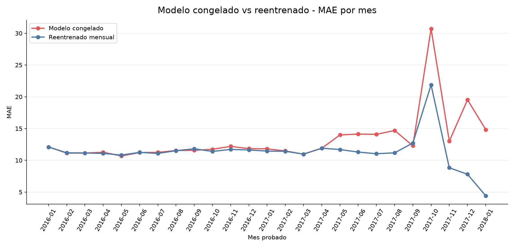
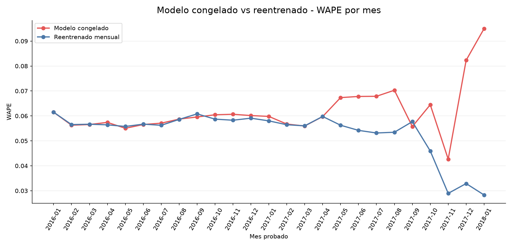
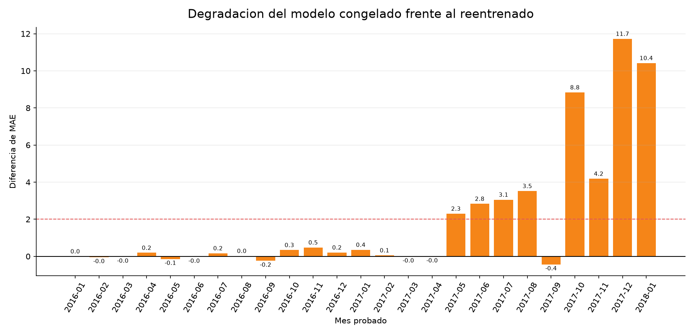
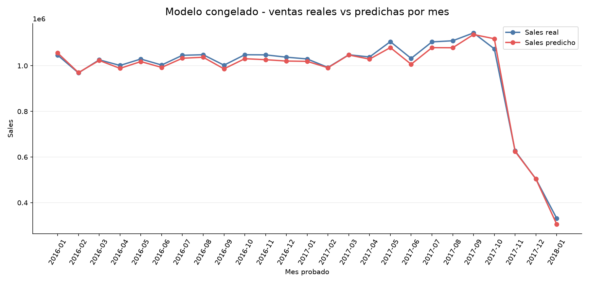
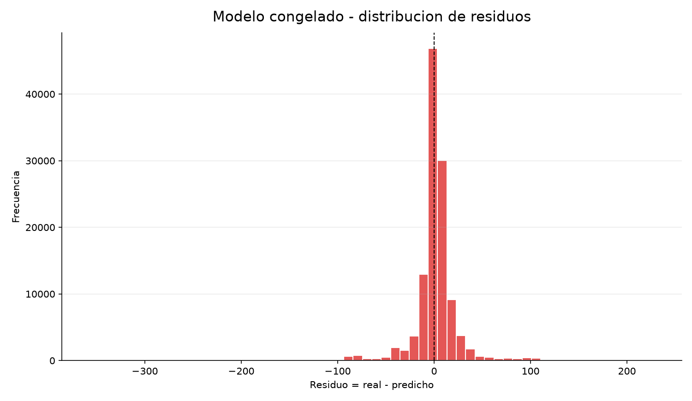

```{r setup, include=FALSE}
knitr::opts_chunk$set(echo = FALSE, warning = FALSE, message = FALSE)
```

# Modelo Congelado

## Pregunta

En la validacion walk-forward anterior el modelo se reentrenaba en cada mes con una ventana expansiva. Este informe prueba lo contrario:

- se entrena una sola vez con los datos de 2015;
- se deja el modelo congelado;
- se predicen todos los meses futuros, de 2016-01 a 2018-01, sin volver a entrenar.

El objetivo es ver cuanto tarda en degradarse el modelo si no se actualiza.

---

# 1. Resultado General

| metrica | modelo congelado | reentrenado mensual |
| --- | ---: | ---: |
| fits del modelo | 1 | 25 |
| meses evaluados | 25 | 25 |
| filas fuera de muestra | 117869 | 117869 |
| MAE | 12.6116 | 11.4120 |
| RMSE | 23.4891 | 20.8444 |
| R2 | 0.9727 | 0.9785 |
| WAPE | 0.0608 | 0.0550 |
| MAPE | 0.1085 | 0.0955 |

Primer mes con degradacion relativa mayor al 10%: `2017-05`, 17 meses despues del entrenamiento inicial.

Primer mes con degradacion absoluta mayor a 2.0 MAE: `2017-05`, 17 meses despues del entrenamiento inicial.

Lectura practica: el modelo congelado aguanta 16 meses sin degradacion clara. La primera senal fuerte aparece en el mes 17, `2017-05`.

El peor gap frente al reentrenamiento mensual ocurre en `2017-12`: el modelo congelado queda 11.7257 puntos de MAE por encima del modelo reentrenado.

---

# 2. Auditoria

| check | estado | lectura |
| --- | --- | --- |
| fit_count | 1 | El modelo solo se entrena una vez con 2015 |
| test_period | 2016-01 a 2018-01 | Prediccion mensual futura sin reentrenar |
| categorical_encoding | OneHotEncoder dentro del pipeline | Mismo pipeline que walk-forward; categorias nuevas controladas por handle_unknown |
| payment_one_hot | bool en dataset, excluido del modelo | No se usa porque el metodo de pago no se conoce antes de completar compra |
| leakage_excluded | excluido | Sales, Sales per customer, Order Item Total, Benefit per order, Order Profit Per Order, Order Item Profit Ratio, Order Status, Delivery Status, Late_delivery_risk, is_late_delivery, is_shipping_canceled, is_order_canceled, is_suspected_fraud, is_payment_problem, is_order_problem, Type, payment_type_cash, payment_type_debit, payment_type_payment, payment_type_transfer, payment_type |

Lectura: se usa el mismo criterio de variables y leakage que en la validacion temporal anterior. La diferencia es solo operacional: aqui no se reentrena despues de 2015.

---

# 3. Comparacion Mes a Mes

| test_month | month_index_after_train | static_mae | walk_forward_mae | mae_gap_static_minus_walk | mae_ratio_static_vs_walk | static_wape | walk_forward_wape |
| --- | --- | --- | --- | --- | --- | --- | --- |
| 2016-01 | 1 | 12.0999 | 12.0999 | 0.0 | 1.0 | 0.0615 | 0.0615 |
| 2016-02 | 2 | 11.1359 | 11.1841 | -0.0482 | 0.9957 | 0.0563 | 0.0565 |
| 2016-03 | 3 | 11.133 | 11.1571 | -0.0241 | 0.9978 | 0.0565 | 0.0567 |
| 2016-04 | 4 | 11.2761 | 11.0835 | 0.1926 | 1.0174 | 0.0574 | 0.0564 |
| 2016-05 | 5 | 10.6841 | 10.8267 | -0.1426 | 0.9868 | 0.055 | 0.0558 |
| 2016-06 | 6 | 11.2229 | 11.2524 | -0.0295 | 0.9974 | 0.0565 | 0.0567 |
| 2016-07 | 7 | 11.253 | 11.0853 | 0.1677 | 1.0151 | 0.0571 | 0.0562 |
| 2016-08 | 8 | 11.5389 | 11.5148 | 0.0241 | 1.0021 | 0.0587 | 0.0586 |
| 2016-09 | 9 | 11.5721 | 11.8136 | -0.2416 | 0.9796 | 0.0596 | 0.0608 |
| 2016-10 | 10 | 11.7378 | 11.3981 | 0.3397 | 1.0298 | 0.0605 | 0.0587 |
| 2016-11 | 11 | 12.1963 | 11.717 | 0.4792 | 1.0409 | 0.0607 | 0.0583 |
| 2016-12 | 12 | 11.8416 | 11.6338 | 0.2078 | 1.0179 | 0.0601 | 0.0591 |
| 2017-01 | 13 | 11.8025 | 11.4495 | 0.353 | 1.0308 | 0.0598 | 0.058 |
| 2017-02 | 14 | 11.478 | 11.4231 | 0.0549 | 1.0048 | 0.0567 | 0.0565 |
| 2017-03 | 15 | 10.9657 | 10.9788 | -0.0132 | 0.9988 | 0.0559 | 0.056 |
| 2017-04 | 16 | 11.8984 | 11.9087 | -0.0103 | 0.9991 | 0.0597 | 0.0598 |
| 2017-05 | 17 | 14.0003 | 11.6974 | 2.3029 | 1.1969 | 0.0673 | 0.0563 |
| 2017-06 | 18 | 14.1327 | 11.2984 | 2.8344 | 1.2509 | 0.0678 | 0.0542 |
| 2017-07 | 19 | 14.0929 | 11.0381 | 3.0548 | 1.2767 | 0.0679 | 0.0532 |
| 2017-08 | 20 | 14.6979 | 11.1773 | 3.5206 | 1.315 | 0.0703 | 0.0535 |
| 2017-09 | 21 | 12.2835 | 12.7186 | -0.4351 | 0.9658 | 0.0557 | 0.0577 |
| 2017-10 | 22 | 30.7114 | 21.8736 | 8.8378 | 1.404 | 0.0645 | 0.0459 |
| 2017-11 | 23 | 13.0152 | 8.8298 | 4.1854 | 1.474 | 0.0427 | 0.0289 |
| 2017-12 | 24 | 19.5265 | 7.8008 | 11.7257 | 2.5031 | 0.0823 | 0.0329 |
| 2018-01 | 25 | 14.8398 | 4.4214 | 10.4184 | 3.3563 | 0.095 | 0.0283 |


## MAE: modelo congelado vs reentrenado



**Lectura:** Si la linea roja se separa de la azul, el modelo congelado empieza a perder ventaja por no actualizarse.


## WAPE: modelo congelado vs reentrenado



**Lectura:** Compara el error relativo mensual sobre el volumen de ventas real.


## Gap de MAE por no reentrenar



**Lectura:** Las barras positivas indican meses donde el modelo congelado comete mas error que el reentrenado.


## Ventas reales vs predichas con modelo congelado



**Lectura:** Revisa si el modelo congelado sigue el volumen mensual total, aunque no haya aprendido los meses recientes.


## Residuos del modelo congelado



**Lectura:** Distribucion global de errores de todas las predicciones futuras hechas sin reentrenar.


---

# 4. Conclusion

El modelo congelado permite comprobar la degradacion real por falta de actualizacion. Si la diferencia frente al reentrenamiento mensual es pequena, el modelo puede actualizarse con menos frecuencia. Si el gap aparece pronto o se concentra en meses concretos, conviene reentrenar periodicamente o revisar cambios en mix de productos, volumen y descuentos.

En este problema concreto, `Sales` por linea sigue dependiendo sobre todo de precio, cantidad y descuento. Por eso el modelo puede aguantar relativamente bien sin reentrenar mientras esas relaciones no cambien de forma estructural.
