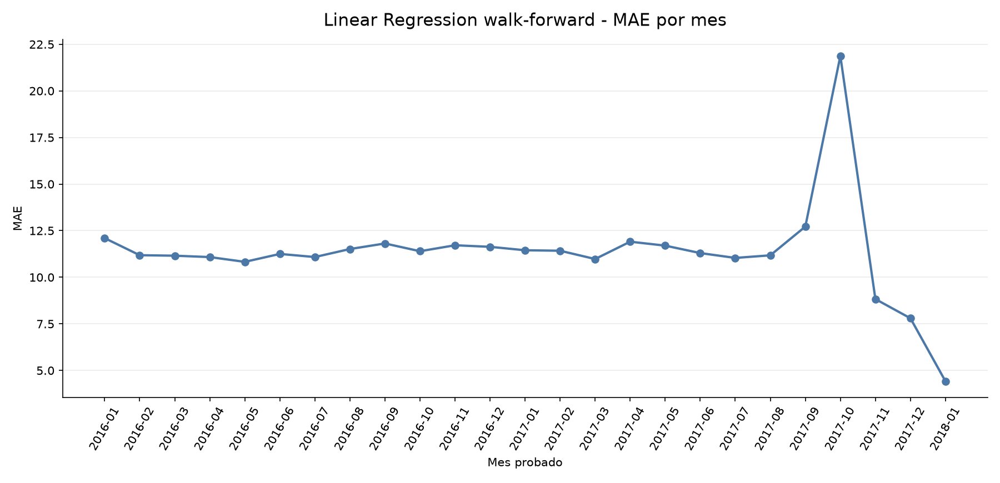
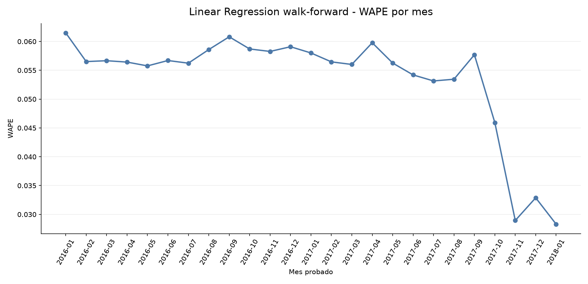
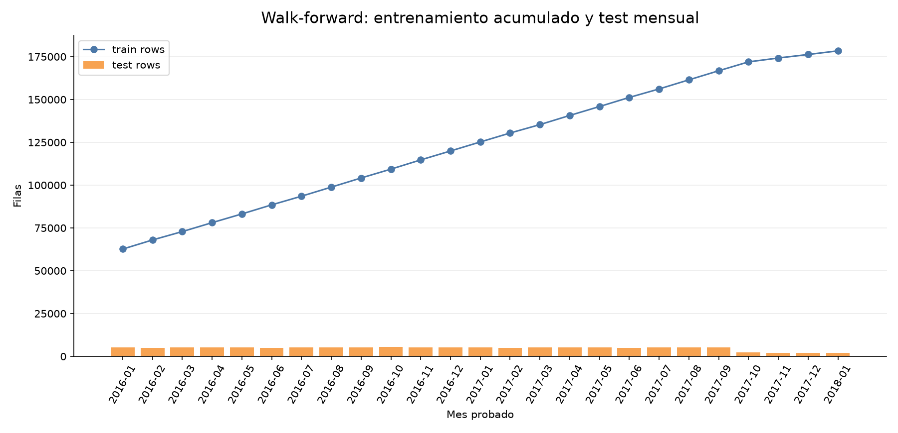
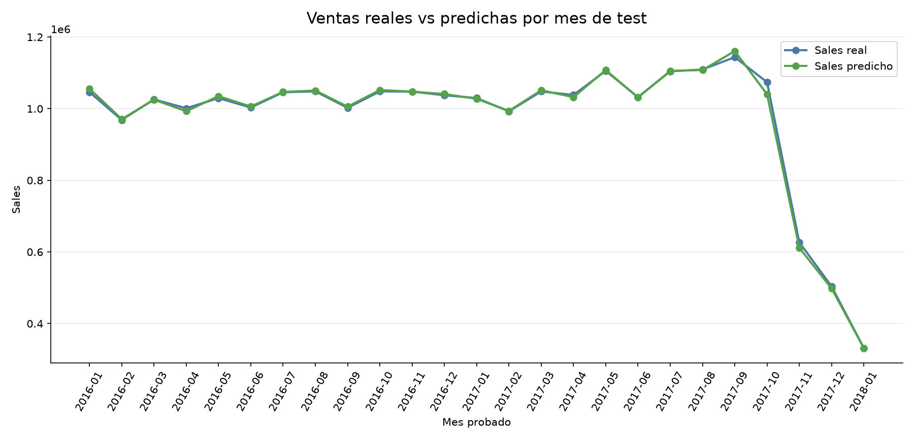
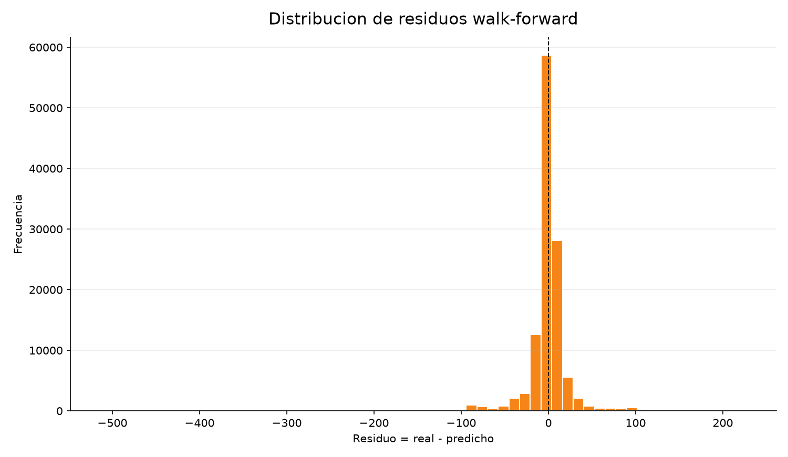

```{r setup, include=FALSE}
knitr::opts_chunk$set(echo = FALSE, warning = FALSE, message = FALSE)
```

# Walk-Forward Validation

## Modelo de ventas `Sales`

Esta validacion simula un uso real del modelo al pasar los meses:

1. Se entrena con los primeros 12 meses.
2. Se predice el mes siguiente, que el modelo no ha visto.
3. Ese mes se incorpora al entrenamiento.
4. Se repite el proceso hasta el ultimo mes disponible.

El modelo probado es `Linear Regression`, usando las mismas familias de variables del modelo de ventas sin lags: geografia, comprador, producto, precio/cantidad, descuentos/ofertas y calendario. En esta validacion las variables categoricas se codifican con `OneHotEncoder` dentro del pipeline para evitar imponer un orden artificial a paises, productos o compradores.

---

# 1. Resultado General

| metrica | valor |
| --- | ---: |
| folds mensuales | 25 |
| filas evaluadas fuera de muestra | 117869 |
| MAE ponderado por filas | 11.4120 |
| MSE ponderado por filas | 434.4888 |
| RMSE global | 20.8444 |
| R2 global | 0.9785 |
| WAPE global | 0.0550 |
| MAPE global | 0.0955 |

Mejor mes por MAE: `2018-01`, con MAE 4.4214.

Peor mes por MAE: `2017-10`, con MAE 21.8736.

---

# 2. Auditoria de Variables y Leakage

| check | estado | lectura |
| --- | --- | --- |
| order_datetime | datetime64[us] | Parseado a datetime dentro del script |
| Sales | float64 | Target numerico float |
| Order Item Quantity | int64 | Cantidad numerica usada como feature |
| categorical_encoding | OneHotEncoder dentro del pipeline | handle_unknown=infrequent_if_exist, min_frequency=20 |
| payment_one_hot | bool en dataset, excluido del modelo | No se usa porque el metodo de pago no se conoce antes de completar compra |
| leakage_excluded | excluido | Sales, Sales per customer, Order Item Total, Benefit per order, Order Profit Per Order, Order Item Profit Ratio, Order Status, Delivery Status, Late_delivery_risk, is_late_delivery, is_shipping_canceled, is_order_canceled, is_suspected_fraud, is_payment_problem, is_order_problem, Type, payment_type_cash, payment_type_debit, payment_type_payment, payment_type_transfer, payment_type |
| walk_forward | 12 meses iniciales + 1 mes de test | Ventana expansiva: cada mes probado se suma al entrenamiento posterior |
| feature_count_before_encoding | 32 | 13 categoricas y 19 numericas |

Lectura: el modelo no usa estados posteriores, beneficios, totales derivados directos ni metodo de pago. `Sales` es el target y queda fuera de las variables. `Order Item Product Price`, `Order Item Quantity` y descuentos se mantienen porque este modelo predice el importe de una linea de pedido ya formada; si el objetivo fuese forecast de demanda antes de la compra, esas variables no estarian disponibles y habria que redefinir el problema.

---

# 3. Metricas por Mes

| fold | train_month_start | train_month_end | test_month_start | test_rows | mae | rmse | r2 | wape | mape_nonzero_actual |
| --- | --- | --- | --- | --- | --- | --- | --- | --- | --- |
| 1 | 2015-01 | 2015-12 | 2016-01 | 5317 | 12.0999 | 20.6949 | 0.9663 | 0.0615 | 0.107 |
| 2 | 2015-01 | 2016-01 | 2016-02 | 4894 | 11.1841 | 19.8405 | 0.9684 | 0.0565 | 0.0999 |
| 3 | 2015-01 | 2016-02 | 2016-03 | 5210 | 11.1571 | 19.8499 | 0.9684 | 0.0567 | 0.1016 |
| 4 | 2015-01 | 2016-03 | 2016-04 | 5097 | 11.0835 | 19.7685 | 0.9691 | 0.0564 | 0.0982 |
| 5 | 2015-01 | 2016-04 | 2016-05 | 5302 | 10.8267 | 19.1777 | 0.969 | 0.0558 | 0.1001 |
| 6 | 2015-01 | 2016-05 | 2016-06 | 5054 | 11.2524 | 19.9612 | 0.9685 | 0.0567 | 0.0992 |
| 7 | 2015-01 | 2016-06 | 2016-07 | 5305 | 11.0853 | 20.1341 | 0.9673 | 0.0562 | 0.0984 |
| 8 | 2015-01 | 2016-07 | 2016-08 | 5334 | 11.5148 | 20.651 | 0.9656 | 0.0586 | 0.103 |
| 9 | 2015-01 | 2016-08 | 2016-09 | 5160 | 11.8136 | 19.9606 | 0.9675 | 0.0608 | 0.1061 |
| 10 | 2015-01 | 2016-09 | 2016-10 | 5398 | 11.3981 | 19.8839 | 0.9667 | 0.0587 | 0.104 |
| 11 | 2015-01 | 2016-10 | 2016-11 | 5210 | 11.717 | 20.868 | 0.9666 | 0.0583 | 0.1005 |
| 12 | 2015-01 | 2016-11 | 2016-12 | 5269 | 11.6338 | 20.5288 | 0.9663 | 0.0591 | 0.1027 |
| 13 | 2015-01 | 2016-12 | 2017-01 | 5217 | 11.4495 | 20.4775 | 0.9663 | 0.058 | 0.0975 |
| 14 | 2015-01 | 2017-01 | 2017-02 | 4906 | 11.4231 | 20.52 | 0.9663 | 0.0565 | 0.0964 |
| 15 | 2015-01 | 2017-02 | 2017-03 | 5347 | 10.9788 | 19.5501 | 0.9684 | 0.056 | 0.0954 |
| 16 | 2015-01 | 2017-03 | 2017-04 | 5212 | 11.9087 | 22.3039 | 0.9605 | 0.0598 | 0.0971 |
| 17 | 2015-01 | 2017-04 | 2017-05 | 5317 | 11.6974 | 21.62 | 0.9603 | 0.0563 | 0.0766 |
| 18 | 2015-01 | 2017-05 | 2017-06 | 4951 | 11.2984 | 20.8647 | 0.9645 | 0.0542 | 0.0761 |
| 19 | 2015-01 | 2017-06 | 2017-07 | 5318 | 11.0381 | 20.7008 | 0.9643 | 0.0532 | 0.0767 |
| 20 | 2015-01 | 2017-07 | 2017-08 | 5305 | 11.1773 | 20.8744 | 0.9643 | 0.0535 | 0.0752 |
| 21 | 2015-01 | 2017-08 | 2017-09 | 5189 | 12.7186 | 26.3708 | 0.9579 | 0.0577 | 0.0749 |
| 22 | 2015-01 | 2017-09 | 2017-10 | 2255 | 21.8736 | 39.5162 | 0.9933 | 0.0459 | 0.1198 |
| 23 | 2015-01 | 2017-10 | 2017-11 | 2055 | 8.8298 | 10.9154 | 0.9942 | 0.0289 | 0.035 |
| 24 | 2015-01 | 2017-11 | 2017-12 | 2124 | 7.8008 | 12.502 | 0.9984 | 0.0329 | 0.1554 |
| 25 | 2015-01 | 2017-12 | 2018-01 | 2123 | 4.4214 | 5.6724 | 0.9983 | 0.0283 | 0.1153 |


## MAE por mes probado



**Lectura:** Muestra si el error se mantiene estable cuando el modelo avanza mes a mes con entrenamiento acumulado.


## WAPE por mes probado



**Lectura:** Permite comparar el error relativo sobre el volumen real de ventas de cada mes.


## Tamano de entrenamiento y test



**Lectura:** El entrenamiento crece de forma acumulada y cada prueba corresponde al siguiente mes no visto.


## Ventas reales vs predichas por mes



**Lectura:** Comprueba si el modelo sigue el nivel mensual total de ventas, no solo el error por linea.


## Distribucion de residuos



**Lectura:** Los residuos se concentran cerca de cero, pero hay cola positiva/negativa en lineas donde la combinacion precio-cantidad-descuento se comporta peor.


---

# 4. Comparacion con el Split Anterior

Resultado anterior de `Linear Regression` con split temporal fijo:

| model | split | mae | mse | rmse | r2 | wape | mape_nonzero_actual |
| --- | --- | --- | --- | --- | --- | --- | --- |
| Linear Regression | test | 20.0734 | 1239.125 | 35.2012 | 0.9665 | 0.0869 | 0.1485 |

Esta comparacion sirve como referencia, pero no debe leerse como un cambio de una sola variable: el primer modelo usaba el pipeline original y esta validacion usa `OneHotEncoder`, que es mas adecuado para variables categoricas en una regresion lineal. La conclusion principal aqui es temporal: el modelo lineal mantiene buen rendimiento cuando se entrena solo con meses pasados y se prueba sobre meses futuros no vistos.

---

# 5. Coeficientes Principales

| feature | coefficient | abs_coefficient |
| --- | --- | --- |
| numeric__Order Item Product Price | 133.2537 | 133.2537 |
| categorical__Order State_Mequinez-Tafilalet | 94.3671 | 94.3671 |
| categorical__Order City_Meknes | -92.3645 | 92.3645 |
| categorical__Product Name_The North Face Women's Recon Backpack | 80.6884 | 80.6884 |
| numeric__Order Item Quantity | 76.561 | 76.561 |
| categorical__Product Name_Fitbit The One Wireless Activity & Sleep Trac | 74.6468 | 74.6468 |
| categorical__Product Name_Nike Kids' Grade School KD VI Basketball Shoe | 73.8292 | 73.8292 |
| categorical__Product Name_Clicgear 8.0 Shoe Brush | -72.9552 | 72.9552 |
| categorical__Product Name_Nike Men's Free 5.0+ Running Shoe | 71.0441 | 71.0441 |
| categorical__Product Name_Merrell Women's Grassbow Sport Hiking Shoe | 67.5002 | 67.5002 |
| categorical__Product Name_Under Armour Men's Tech II T-Shirt | -65.2395 | 65.2395 |
| categorical__Product Name_Bag Boy M330 Push Cart | 64.3929 | 64.3929 |
| categorical__Product Name_Polar FT4 Heart Rate Monitor | 64.0828 | 64.0828 |
| categorical__Product Name_ENO Atlas Hammock Straps | -60.4229 | 60.4229 |
| categorical__Product Name_LIJA Women's Mid-Length Panel Golf Shorts | 59.3009 | 59.3009 |
| categorical__Product Name_Nike Women's Tempo Shorts | -58.376 | 58.376 |
| categorical__Product Name_TaylorMade White Smoke IN-12 Putter | 56.9372 | 56.9372 |
| categorical__Category Name_Golf Balls | -53.9245 | 53.9245 |
| categorical__Product Name_adidas Youth Germany Black/Red Away Match Soc | 53.2677 | 53.2677 |
| categorical__Order State_Delta | -51.2988 | 51.2988 |
| categorical__Order City_Warri | 47.7292 | 47.7292 |
| categorical__Product Name_Top Flite Women's 2014 XL Hybrid | -47.046 | 47.046 |
| categorical__Product Name_Garmin Approach S3 Golf GPS Watch | 44.9117 | 44.9117 |
| categorical__Category Name_Accessories | -44.0452 | 44.0452 |
| categorical__Category Name_As Seen on  TV! | 42.9699 | 42.9699 |

Lectura: en un modelo lineal de `Sales` por linea, las variables de precio, cantidad y descuento deben dominar. Si las categorias aparecen con coeficientes altos, hay que interpretarlas como ajustes de contexto, no como causalidad directa.

---

# 6. Conclusion

La validacion walk-forward confirma si el modelo lineal aguanta el paso del tiempo con datos no vistos mes a mes. Este enfoque es mas cercano a produccion que un unico split, porque cada prediccion se hace solo con informacion historica disponible hasta ese momento.

Para `Sales` por linea, el modelo sigue siendo principalmente una lectura de precio, cantidad y descuento. Es util para estimar el importe de pedidos ya configurados. Para planificacion comercial o inventario, el siguiente problema deberia formularse como demanda agregada por producto/fecha, donde si tendrian mas valor los historicos, calendario y patrones temporales.
