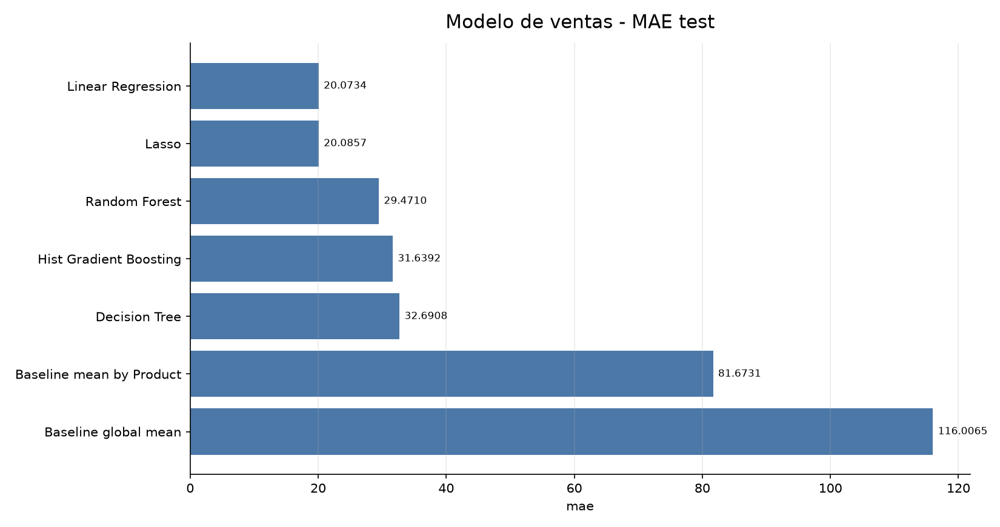
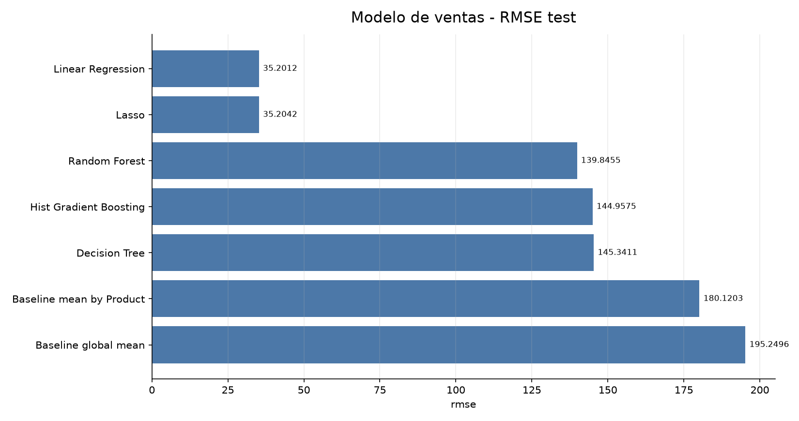
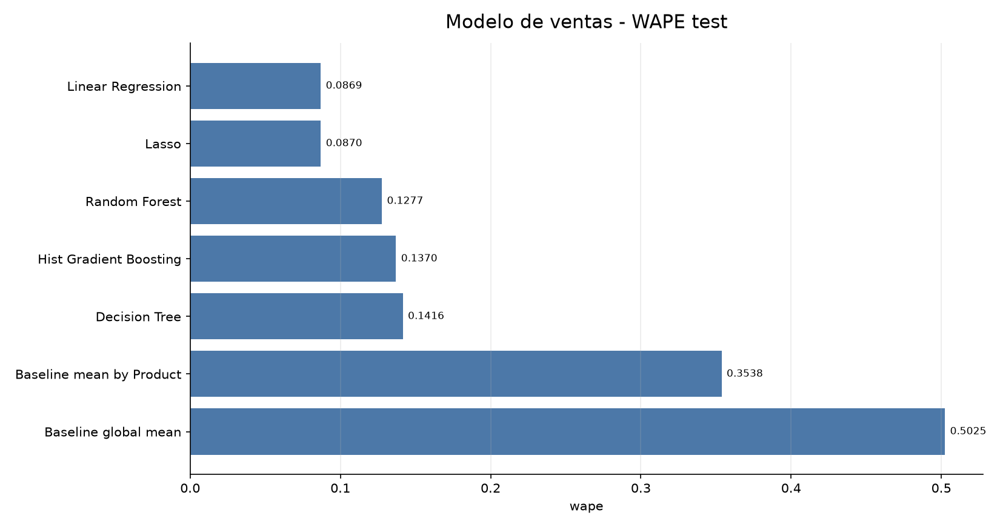
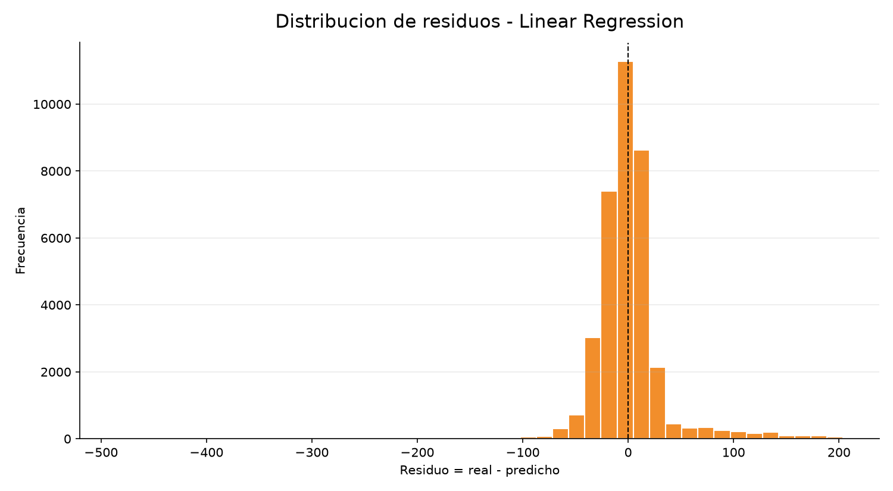
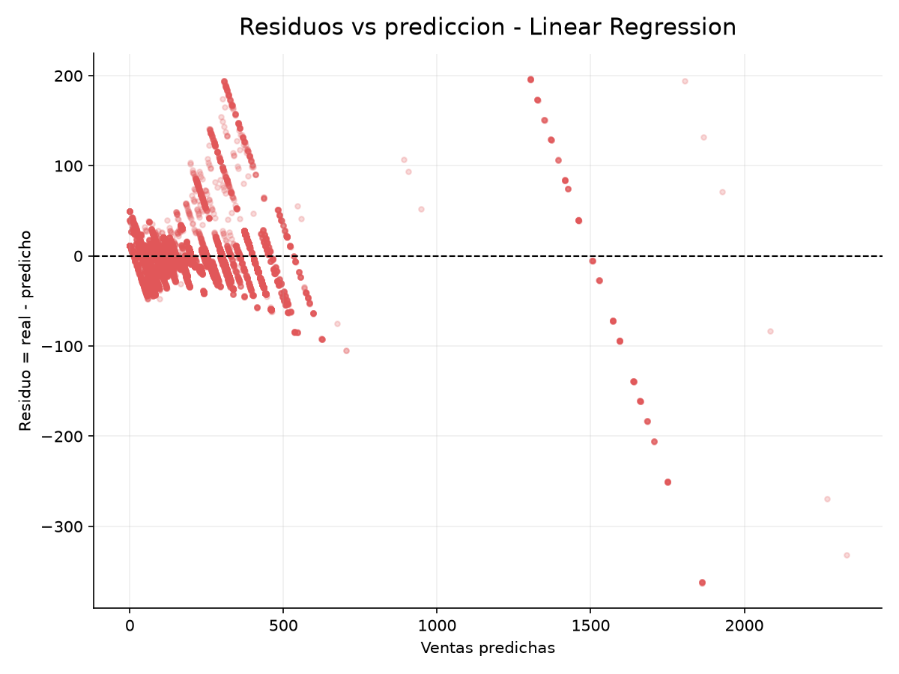
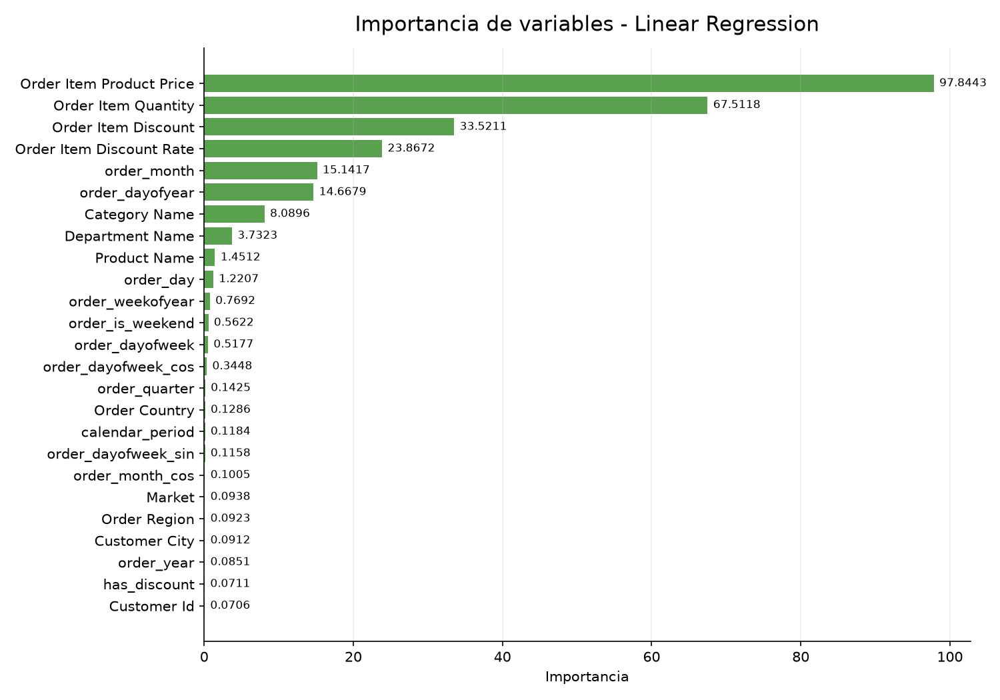

---
title: "Comparacion de Modelos de Ventas"
subtitle: "Sin lags ni rollings"
author: "Proyecto DataCo"
date: "2026-07-06"
output:
  html_document:
    toc: true
    toc_depth: 2
    number_sections: true
    theme: readable
    df_print: paged
---

```{r setup, include=FALSE}
knitr::opts_chunk$set(echo = FALSE, warning = FALSE, message = FALSE)
```

<div align="center">

# Comparacion de Modelos de Ventas

## DataCo Supply Chain

**Objetivo:** comparar modelos para predecir `Sales` usando geografia, comprador, producto, precio/cantidad, descuentos/ofertas y calendario, sin lags ni rollings.

</div>

---

# 1. Resumen Ejecutivo

El mejor modelo en test fue `Linear Regression`.

| Comparacion | MAE | MSE | RMSE | R2 | WAPE | MAPE sin ventas 0 |
| --- | ---: | ---: | ---: | ---: | ---: | ---: |
| Mejor modelo | 20.0734 | 1239.1250 | 35.2012 | 0.9665 | 0.0869 | 0.1485 |
| Baseline por producto | 81.6731 | 32443.3193 | 180.1203 | 0.1226 | 0.3538 | 0.8747 |
| Baseline global | 116.0065 | 38122.4037 | 195.2496 | -0.0310 | 0.5025 | 1.0660 |

Nota importante: este modelo usa `Order Item Product Price` y `Order Item Quantity`. Estas variables explican gran parte de `Sales`, porque la venta por linea depende directamente de precio y cantidad. Por eso el modelo debe interpretarse como prediccion de importe de linea con informacion de carrito/pedido, no como forecast puro de demanda antes de que el cliente elija producto y cantidad.

Lectura principal:

- `Linear Regression` y `Lasso` funcionan mejor que los modelos de arbol en test.
- `Decision Tree`, `Random Forest` e `Hist Gradient Boosting` aprenden casi perfecto en train, pero generalizan peor en test. Esto indica sobreajuste.
- La senal dominante es lineal y viene de precio, cantidad y descuento.
- El metodo de pago queda fuera del modelo principal porque no se conoce antes de completar la compra.

---

# 2. Variables Usadas y Leakage

No se usaron lags ni rollings.

Se excluyeron variables que ya contienen resultado comercial, estado posterior o informacion no disponible antes/casi al cierre de compra:

- `Sales per customer`, `Order Item Total`, beneficios y profit;
- estados posteriores de pedido/envio;
- targets de retraso, cancelacion, fraude o problema;
- metodo de pago (`Type` y `payment_type_*`) para evitar leakage en prediccion antes de completar la compra.

Auditoria de grupos de variables:

| grupo | estado | features_usadas | features_excluidas | motivo |
| --- | --- | --- | --- | --- |
| geografia | Usado | Order Country, Order Region, Order State, Order City, Market, Customer Country, Customer City | - | Disponible antes/casi al formar la venta |
| comprador | Usado | Customer Id, Customer Segment | - | Disponible antes/casi al formar la venta |
| producto | Usado | Product Name, Category Name, Department Name | - | Disponible antes/casi al formar la venta |
| precio_cantidad | Usado | Order Item Product Price, Order Item Quantity | - | Disponible antes/casi al formar la venta |
| descuentos_ofertas | Usado | Order Item Discount, Order Item Discount Rate, has_discount | - | Disponible antes/casi al formar la venta |
| calendario | Usado | order_year, order_month, order_day, order_dayofweek, order_dayofyear, order_weekofyear, order_quarter, order_hour, order_is_weekend, calendar_period, is_generic_fixed_holiday | - | Disponible antes/casi al formar la venta |
| metodo_pago | Excluido | - | payment_type_cash, payment_type_debit, payment_type_payment, payment_type_transfer, Type | No usado para evitar leakage o porque no esta disponible antes de la compra |

Features finales usadas:

| feature |
| --- |
| Order Country |
| Order Region |
| Order State |
| Order City |
| Market |
| Customer Country |
| Customer City |
| Customer Segment |
| Customer Id |
| Category Name |
| Department Name |
| Product Name |
| calendar_period |
| Order Item Product Price |
| Order Item Quantity |
| Order Item Discount |
| Order Item Discount Rate |
| order_year |
| order_month |
| order_day |
| order_dayofweek |
| order_dayofyear |
| order_weekofyear |
| order_quarter |
| order_hour |
| order_is_weekend |
| order_month_sin |
| order_month_cos |
| order_dayofweek_sin |
| order_dayofweek_cos |
| is_generic_fixed_holiday |
| has_discount |

---

# 3. Modelos Comparados

- `Baseline global mean`: media historica global de `Sales` en train.
- `Baseline mean by Product`: media historica de `Sales` por `Product Name` en train.
- `Linear Regression`.
- `Lasso`.
- `Decision Tree`.
- `Random Forest`.
- `Hist Gradient Boosting`.

El split fue temporal: el 80% inicial por fecha de pedido para train y el 20% final para test.

---

# 4. Resultados Completos

MAPE excluye ventas reales 0 para evitar division por cero. WAPE se calcula como `sum(abs(error)) / sum(abs(real))`.

| model | split | mae | mse | rmse | r2 | wape | mape_nonzero_actual | residual_mean | residual_median | residual_std | train_seconds |
| --- | --- | --- | --- | --- | --- | --- | --- | --- | --- | --- | --- |
| Linear Regression | test | 20.0734 | 1239.125 | 35.2012 | 0.9665 | 0.0869 | 0.1485 | 0.1817 | -1.7144 | 35.2007 | 1.5767 |
| Lasso | test | 20.0857 | 1239.3373 | 35.2042 | 0.9665 | 0.087 | 0.1487 | 0.0797 | -1.8076 | 35.2041 | 1.9982 |
| Random Forest | test | 29.471 | 19556.7563 | 139.8455 | 0.4711 | 0.1277 | 0.066 | 25.2102 | 0.0 | 137.5544 | 36.2465 |
| Hist Gradient Boosting | test | 31.6392 | 21012.6837 | 144.9575 | 0.4317 | 0.137 | 0.0672 | 26.4022 | 0.0002 | 142.5328 | 11.302 |
| Decision Tree | test | 32.6908 | 21124.0231 | 145.3411 | 0.4287 | 0.1416 | 0.0766 | 26.8846 | 0.0 | 142.8329 | 2.781 |
| Baseline mean by Product | test | 81.6731 | 32443.3193 | 180.1203 | 0.1226 | 0.3538 | 0.8747 | 26.0729 | 0.0 | 178.2232 | 0.0 |
| Baseline global mean | test | 116.0065 | 38122.4037 | 195.2496 | -0.031 | 0.5025 | 1.066 | 33.8732 | 2.9926 | 192.2889 | 0.0 |
| Random Forest | train | 0.0 | 0.0 | 0.0 | 1.0 | 0.0 | 0.0 | 0.0 | 0.0 | 0.0 | 36.2465 |
| Decision Tree | train | 0.0 | 0.0 | 0.0 | 1.0 | 0.0 | 0.0 | 0.0 | 0.0 | 0.0 | 2.781 |
| Hist Gradient Boosting | train | 0.0013 | 0.0 | 0.0033 | 1.0 | 0.0 | 0.0 | 0.0 | 0.0001 | 0.0033 | 11.302 |
| Lasso | train | 19.0972 | 1040.5453 | 32.2575 | 0.9161 | 0.0969 | 0.1412 | -0.0564 | -0.2318 | 32.2574 | 1.9982 |
| Linear Regression | train | 19.098 | 1040.5353 | 32.2573 | 0.9161 | 0.0969 | 0.1413 | -0.0565 | -0.2293 | 32.2573 | 1.5767 |
| Baseline mean by Product | train | 39.526 | 4044.8503 | 63.5991 | 0.6737 | 0.2006 | 0.381 | 0.0 | 0.0 | 63.5991 | 0.0 |
| Baseline global mean | train | 89.5903 | 12396.8215 | 111.341 | 0.0 | 0.4548 | 0.7902 | -0.0 | -17.0274 | 111.341 | 0.0 |


## Grafico 1. MAE en test



**Lectura:** MAE es la metrica principal para comparar el error medio absoluto en importe de venta.


---


## Grafico 2. RMSE en test



**Lectura:** RMSE penaliza mas los errores grandes. Si sube mucho frente a MAE, hay ventas puntuales dificiles de predecir.


---


## Grafico 3. WAPE en test



**Lectura:** WAPE resume el error absoluto frente al total de ventas reales.


---

# 5. Residuos del Mejor Modelo

Resumen global de residuos:

| index | Order Id | absolute_error | residual |
| --- | --- | --- | --- |
| rows | 36104.0 |  |  |
| mae |  | 20.0734 |  |
| residual_mean |  |  | 0.1817 |
| residual_median |  |  | -1.7144 |
| residual_std |  |  | 35.2012 |


## Grafico 4. Histograma de residuos



**Lectura:** Permite ver si el modelo tiende a subestimar o sobreestimar ventas.


---


## Grafico 5. Residuos vs prediccion



**Lectura:** Busca patrones de error por tamano de venta predicha.


---

# 6. Importancia de Variables

Importancia del mejor modelo:

| model | feature | importance | coefficient |
| --- | --- | --- | --- |
| Linear Regression | Order Item Product Price | 97.8443 | 97.844276396483 |
| Linear Regression | Order Item Quantity | 67.5118 | 67.51179079173554 |
| Linear Regression | Order Item Discount | 33.5211 | 33.5211256771556 |
| Linear Regression | Order Item Discount Rate | 23.8672 | -23.867205260798045 |
| Linear Regression | order_month | 15.1417 | -15.141722439911819 |
| Linear Regression | order_dayofyear | 14.6679 | 14.667943417921034 |
| Linear Regression | Category Name | 8.0896 | -8.089606551088677 |
| Linear Regression | Department Name | 3.7323 | -3.732343275745083 |
| Linear Regression | Product Name | 1.4512 | 1.4511883473949707 |
| Linear Regression | order_day | 1.2207 | -1.2206566847059288 |
| Linear Regression | order_weekofyear | 0.7692 | 0.7692419935661091 |
| Linear Regression | order_is_weekend | 0.5622 | 0.5622110211203925 |
| Linear Regression | order_dayofweek | 0.5177 | -0.5176897541775418 |
| Linear Regression | order_dayofweek_cos | 0.3448 | -0.3448258917051092 |
| Linear Regression | order_quarter | 0.1425 | -0.14246326346242105 |
| Linear Regression | Order Country | 0.1286 | 0.12864616508817073 |
| Linear Regression | calendar_period | 0.1184 | 0.11841357656137577 |
| Linear Regression | order_dayofweek_sin | 0.1158 | -0.11575735098820447 |
| Linear Regression | order_month_cos | 0.1005 | -0.10053027293791128 |
| Linear Regression | Market | 0.0938 | -0.09375785239406222 |
| Linear Regression | Order Region | 0.0923 | -0.09228498606515312 |
| Linear Regression | Customer City | 0.0912 | 0.09118814288938268 |
| Linear Regression | order_year | 0.0851 | 0.08512675426471938 |
| Linear Regression | has_discount | 0.0711 | 0.07105117027461336 |
| Linear Regression | Customer Id | 0.0706 | -0.07057727277371681 |


En `Linear Regression`, la importancia se interpreta como el valor absoluto del coeficiente estandarizado. Es especialmente fiable para comparar variables numericas como precio, cantidad y descuento; en variables categoricas codificadas de forma ordinal debe leerse como una aproximacion.

## Grafico 6. Importancia de variables



**Lectura:** Muestra que variables explican mas la prediccion del mejor modelo.


---

# 7. Decision

Esta primera comparacion es deliberadamente sin lags ni rollings. Sirve para establecer un punto de partida limpio.

Lecturas esperadas:

- si precio y cantidad dominan, el problema esta muy condicionado por la composicion de la linea de pedido;
- si producto/categoria aportan mucho, conviene crear historicos por producto en la siguiente iteracion;
- si geografia o calendario aportan poco, pueden quedar como variables auxiliares;
- el metodo de pago queda fuera del modelo principal por riesgo de leakage antes de que la compra se complete.

Siguiente paso natural: probar lags/rollings historicos por producto, categoria, pais/ciudad y comprador, comparando siempre contra el baseline por producto.


