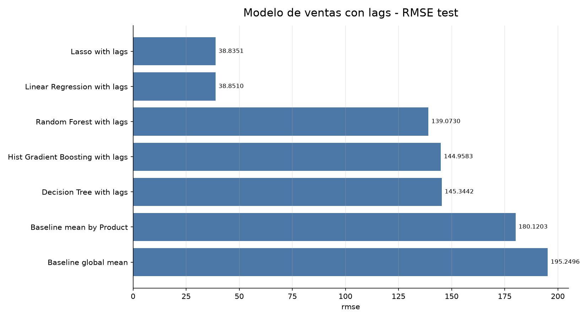
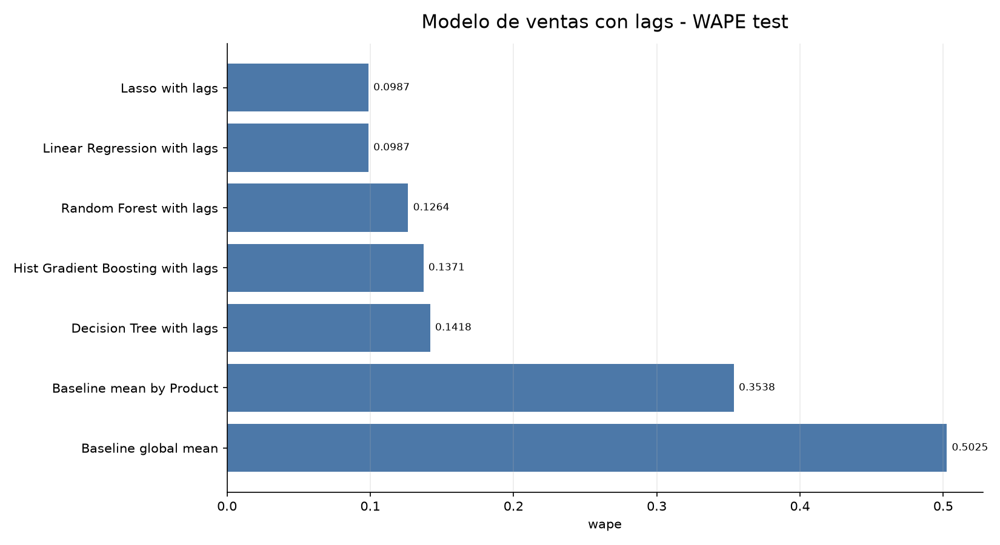
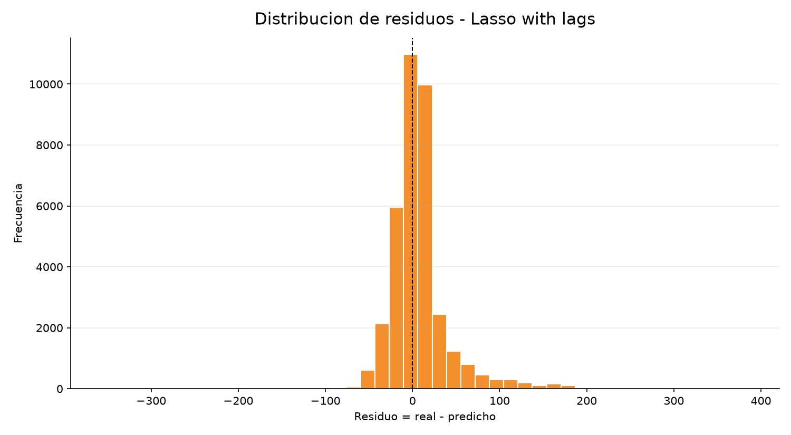
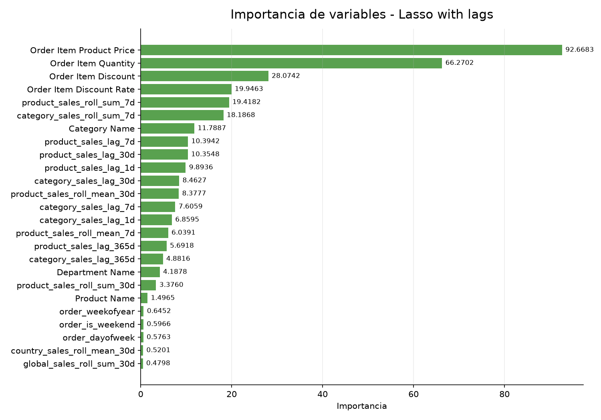

---
title: "Modelo de Ventas con Lags y Rollings"
subtitle: "Comparacion contra modelo sin historicos"
author: "Proyecto DataCo"
date: "2026-07-06"
output:
  html_document:
    toc: true
    toc_depth: 2
    number_sections: true
    theme: readable
    df_print: paged
---

```{r setup, include=FALSE}
knitr::opts_chunk$set(echo = FALSE, warning = FALSE, message = FALSE)
```

<div align="center">

# Modelo de Ventas con Lags y Rollings

## DataCo Supply Chain

**Objetivo:** comprobar si historicos diarios por producto, categoria, pais, cliente y ventas globales mejoran el modelo de `Sales`.

</div>

---

# 1. Resumen Ejecutivo

El mejor modelo con historicos en test fue `Lasso with lags`.

| Modelo | MAE | MSE | RMSE | R2 | WAPE | MAPE |
| --- | ---: | ---: | ---: | ---: | ---: | ---: |
| Mejor con lags/rollings | 22.7814 | 1508.1668 | 38.8351 | 0.9592 | 0.0987 | 0.1425 |

Comparacion directa: **el mejor modelo con historicos empeora en 2.7080 MAE frente a Linear Regression sin lags**.

Los lags y rollings se calcularon siempre con dias anteriores. Para una lectura en horas:

- 1 dia = 24 horas;
- 7 dias = 168 horas;
- 30 dias = 720 horas;
- 365 dias = 8760 horas.

---

# 2. Auditoria Rapida de Leakage y Tipos

| check | estado | lectura |
| --- | --- | --- |
| order_datetime | datetime64[us] | Parseado a datetime dentro del script |
| Order Item Quantity | int64 | Cantidad numerica/int |
| Sales | float64 | Target numerico float |
| price_discount | float | Precio, descuento y tasa de descuento numericos |
| payment_one_hot | bool en dataset, excluido del modelo | No se usa porque el metodo de pago no se conoce antes de completar compra |
| leakage_excluded | excluido | Sales, Sales per customer, Order Item Total, Benefit per order, Order Profit Per Order, Order Item Profit Ratio, Order Status, Delivery Status, Late_delivery_risk, is_late_delivery, is_shipping_canceled, is_order_canceled, is_suspected_fraud, is_payment_problem, is_order_problem, Type, payment_type_cash, payment_type_debit, payment_type_payment, payment_type_transfer, payment_type |
| categorical_encoding | OrdinalEncoder dentro del pipeline | No se escriben categorias ordinales al CSV; se transforman durante entrenamiento |
| lags | 20 features | Lags diarios exactos 1, 7, 30 y 365 dias; equivalen a 24, 168, 720 y 8760 horas |
| rollings | 16 features | Rolling semanal 7 dias y mensual 30 dias, siempre con shift previo |
| feature_count | 68 | Features usadas por el modelo con historicos |

Puntos clave:

- `order_datetime` se parsea a datetime dentro del script.
- `Order Item Quantity` se mantiene numerica/int.
- precio, descuento, tasa de descuento y target son numericos.
- metodo de pago esta en booleanos one-hot en el dataset, pero queda excluido del modelo principal.
- `Order Item Total`, `Sales per customer`, beneficios y estados posteriores siguen fuera por leakage.

---

# 3. Lags y Rollings Creados

Lags exactos diarios:

- 1, 7, 30 y 365 dias.

Grupos:

- ventas globales;
- ventas por producto;
- ventas por categoria;
- ventas por pais de pedido;
- ventas por comprador.

Rollings:

- rolling semanal: 7 dias;
- rolling mensual: 30 dias.

Los rollings se calculan con `shift(1)`: el dia actual no entra en su propio historico.

---

# 4. Resultados con Historicos

| model | split | mae | mse | rmse | r2 | wape | mape_nonzero_actual | residual_mean | residual_median | residual_std | train_seconds |
| --- | --- | --- | --- | --- | --- | --- | --- | --- | --- | --- | --- |
| Lasso with lags | test | 22.7814 | 1508.1668 | 38.8351 | 0.9592 | 0.0987 | 0.1425 | 8.586 | 3.0364 | 37.8741 | 26.0297 |
| Linear Regression with lags | test | 22.7853 | 1509.4038 | 38.851 | 0.9592 | 0.0987 | 0.1425 | 8.647 | 3.1232 | 37.8765 | 3.0742 |
| Random Forest with lags | test | 29.1814 | 19341.2983 | 139.073 | 0.4769 | 0.1264 | 0.0659 | 24.8121 | 0.0 | 136.8417 | 88.8079 |
| Hist Gradient Boosting with lags | test | 31.6481 | 21012.9218 | 144.9583 | 0.4317 | 0.1371 | 0.0675 | 26.409 | 0.0001 | 142.5324 | 24.2522 |
| Decision Tree with lags | test | 32.73 | 21124.9366 | 145.3442 | 0.4287 | 0.1418 | 0.0771 | 26.8664 | 0.0 | 142.8395 | 5.9494 |
| Baseline mean by Product | test | 81.6731 | 32443.3193 | 180.1203 | 0.1226 | 0.3538 | 0.8747 | 26.0729 | 0.0 | 178.2232 | 0.0 |
| Baseline global mean | test | 116.0065 | 38122.4037 | 195.2496 | -0.031 | 0.5025 | 1.066 | 33.8732 | 2.9926 | 192.2889 | 0.0 |
| Decision Tree with lags | train | 0.0 | 0.0 | 0.0 | 1.0 | 0.0 | 0.0 | 0.0 | 0.0 | 0.0 | 5.9494 |
| Random Forest with lags | train | 0.0004 | 0.002 | 0.0449 | 1.0 | 0.0 | 0.0 | -0.0 | 0.0 | 0.0449 | 88.8079 |
| Hist Gradient Boosting with lags | train | 0.0018 | 0.0 | 0.005 | 1.0 | 0.0 | 0.0 | 0.0 | 0.0001 | 0.005 | 24.2522 |
| Lasso with lags | train | 18.7606 | 862.757 | 29.3727 | 0.9304 | 0.0952 | 0.1367 | -0.1839 | -2.4563 | 29.3721 | 26.0297 |
| Linear Regression with lags | train | 18.7606 | 862.667 | 29.3712 | 0.9304 | 0.0952 | 0.1367 | -0.1838 | -2.4548 | 29.3706 | 3.0742 |
| Baseline mean by Product | train | 39.526 | 4044.8503 | 63.5991 | 0.6737 | 0.2006 | 0.381 | 0.0 | 0.0 | 63.5991 | 0.0 |
| Baseline global mean | train | 89.5903 | 12396.8215 | 111.341 | 0.0 | 0.4548 | 0.7902 | -0.0 | -17.0274 | 111.341 | 0.0 |


## Grafico 1. MAE en test


**Lectura:** Compara los modelos entrenados con lags y rollings.


---


## Grafico 2. RMSE en test



**Lectura:** RMSE permite ver si los historicos reducen errores grandes.


---


## Grafico 3. WAPE en test



**Lectura:** WAPE resume el error absoluto frente al total de ventas reales.


---

# 5. Comparacion con Modelo sin Historicos

Resultados anteriores sin lags/rollings:

| model | mae | mse | rmse | r2 | wape | mape_nonzero_actual |
| --- | --- | --- | --- | --- | --- | --- |
| Linear Regression (sin lags) | 20.0734 | 1239.125 | 35.2012 | 0.9665 | 0.0869 | 0.1485 |
| Lasso (sin lags) | 20.0857 | 1239.3373 | 35.2042 | 0.9665 | 0.087 | 0.1487 |
| Random Forest (sin lags) | 29.471 | 19556.7563 | 139.8455 | 0.4711 | 0.1277 | 0.066 |
| Hist Gradient Boosting (sin lags) | 31.6392 | 21012.6837 | 144.9575 | 0.4317 | 0.137 | 0.0672 |
| Decision Tree (sin lags) | 32.6908 | 21124.0231 | 145.3411 | 0.4287 | 0.1416 | 0.0766 |
| Baseline mean by Product (sin lags) | 81.6731 | 32443.3193 | 180.1203 | 0.1226 | 0.3538 | 0.8747 |
| Baseline global mean (sin lags) | 116.0065 | 38122.4037 | 195.2496 | -0.031 | 0.5025 | 1.066 |

Lectura: el punto de referencia real no es el baseline, sino Linear Regression/Lasso sin historicos, porque ya eran muy superiores al baseline.

---

# 6. Residuos e Importancia


## Grafico 4. Histograma de residuos



**Lectura:** Muestra si el mejor modelo con historicos tiende a subestimar o sobreestimar ventas.


---

Importancia del mejor modelo:

| model | feature | importance | coefficient |
| --- | --- | --- | --- |
| Lasso with lags | Order Item Product Price | 92.6683 | 92.6683 |
| Lasso with lags | Order Item Quantity | 66.2702 | 66.2702 |
| Lasso with lags | Order Item Discount | 28.0742 | 28.0742 |
| Lasso with lags | Order Item Discount Rate | 19.9463 | -19.9463 |
| Lasso with lags | product_sales_roll_sum_7d | 19.4182 | 19.4182 |
| Lasso with lags | category_sales_roll_sum_7d | 18.1868 | -18.1868 |
| Lasso with lags | Category Name | 11.7887 | -11.7887 |
| Lasso with lags | product_sales_lag_7d | 10.3942 | -10.3942 |
| Lasso with lags | product_sales_lag_30d | 10.3548 | -10.3548 |
| Lasso with lags | product_sales_lag_1d | 9.8936 | -9.8936 |
| Lasso with lags | category_sales_lag_30d | 8.4627 | 8.4627 |
| Lasso with lags | product_sales_roll_mean_30d | 8.3777 | 8.3777 |
| Lasso with lags | category_sales_lag_7d | 7.6059 | 7.6059 |
| Lasso with lags | category_sales_lag_1d | 6.8595 | 6.8595 |
| Lasso with lags | product_sales_roll_mean_7d | 6.0391 | 6.0391 |
| Lasso with lags | product_sales_lag_365d | 5.6918 | -5.6918 |
| Lasso with lags | category_sales_lag_365d | 4.8816 | 4.8816 |
| Lasso with lags | Department Name | 4.1878 | 4.1878 |
| Lasso with lags | product_sales_roll_sum_30d | 3.376 | 3.376 |
| Lasso with lags | Product Name | 1.4965 | 1.4965 |
| Lasso with lags | order_weekofyear | 0.6452 | 0.6452 |
| Lasso with lags | order_is_weekend | 0.5966 | 0.5966 |
| Lasso with lags | order_dayofweek | 0.5763 | -0.5763 |
| Lasso with lags | country_sales_roll_mean_30d | 0.5201 | -0.5201 |
| Lasso with lags | global_sales_roll_sum_30d | 0.4798 | -0.4798 |


## Grafico 5. Importancia de variables



**Lectura:** Permite ver si los lags/rollings entran entre las variables mas relevantes o si siguen dominando precio, cantidad y descuento.


---

# 7. Decision

Esta iteracion comprueba si los historicos temporales aportan algo sobre el modelo sin lags.

Resultado: los historicos no mejoran el mejor modelo anterior. `Sales` a nivel linea sigue estando dominado por precio, cantidad y descuento. Para este target conviene mantener Linear Regression/Lasso sin lags como referencia principal.

Los lags y rollings si aparecen entre variables relevantes, pero no compensan: anaden ruido o colinealidad y empeoran el error del modelo lineal. Si queremos aprovechar historicos, lo mas razonable es cambiar el objetivo a demanda agregada por producto/fecha, no a importe de una linea de pedido ya formada.


