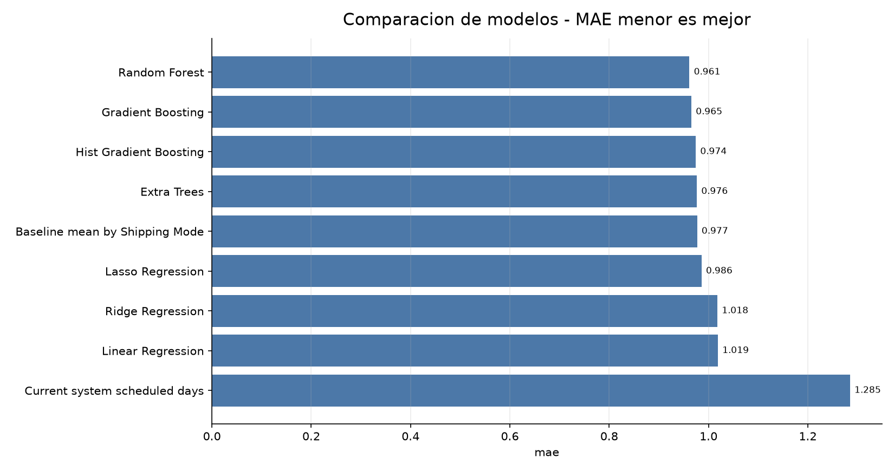
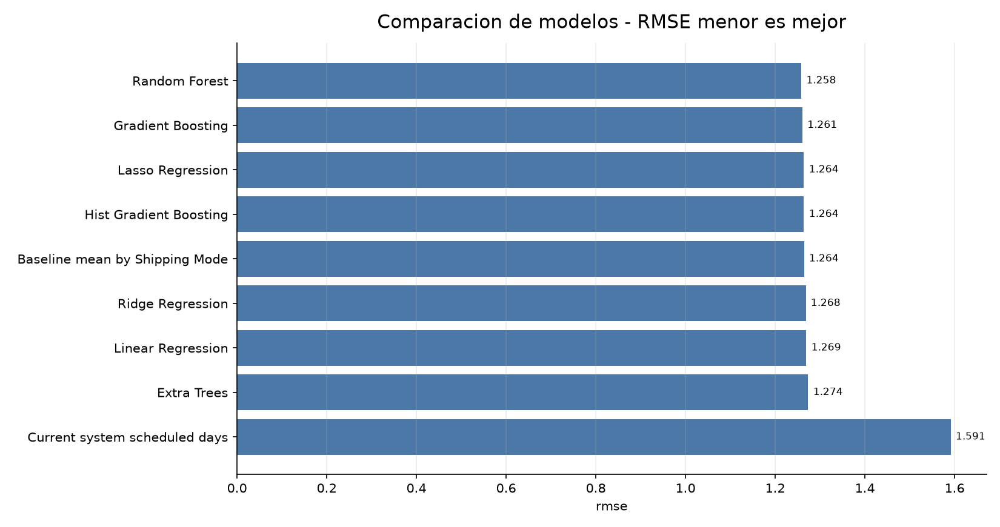
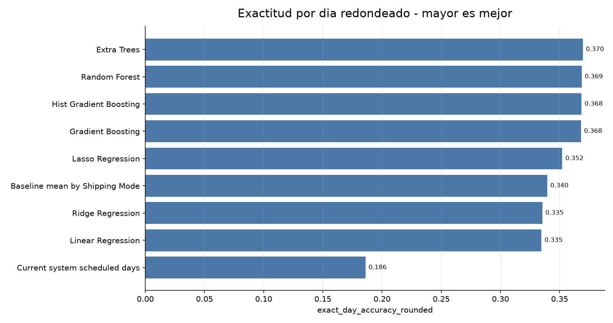
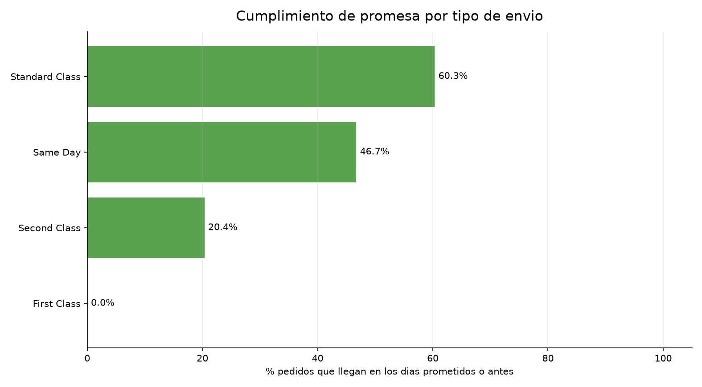
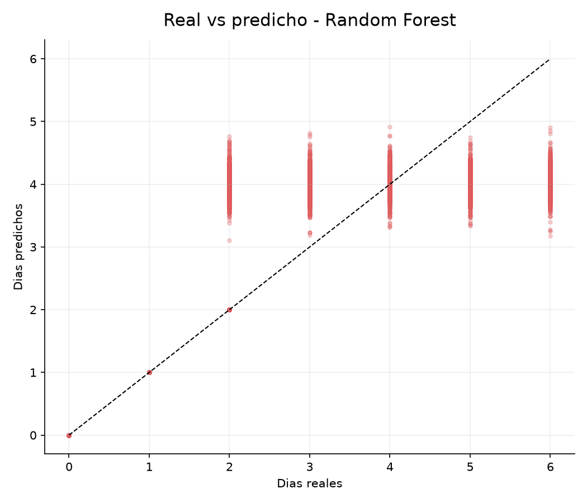
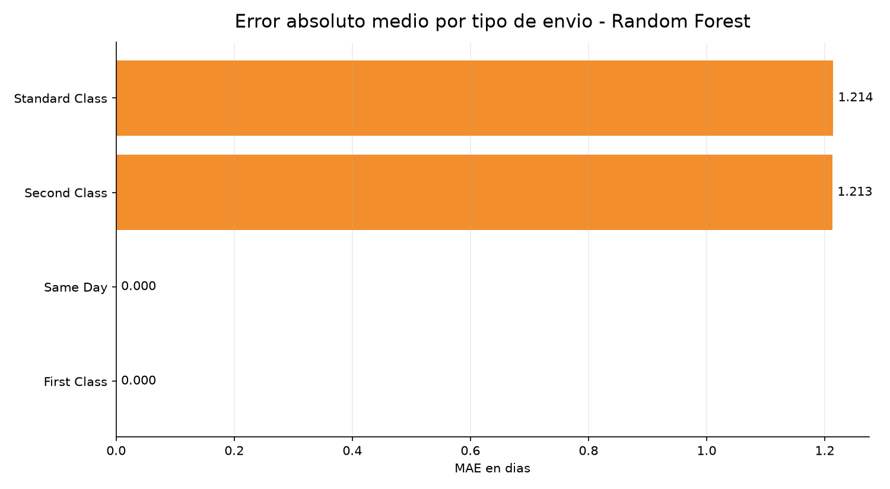
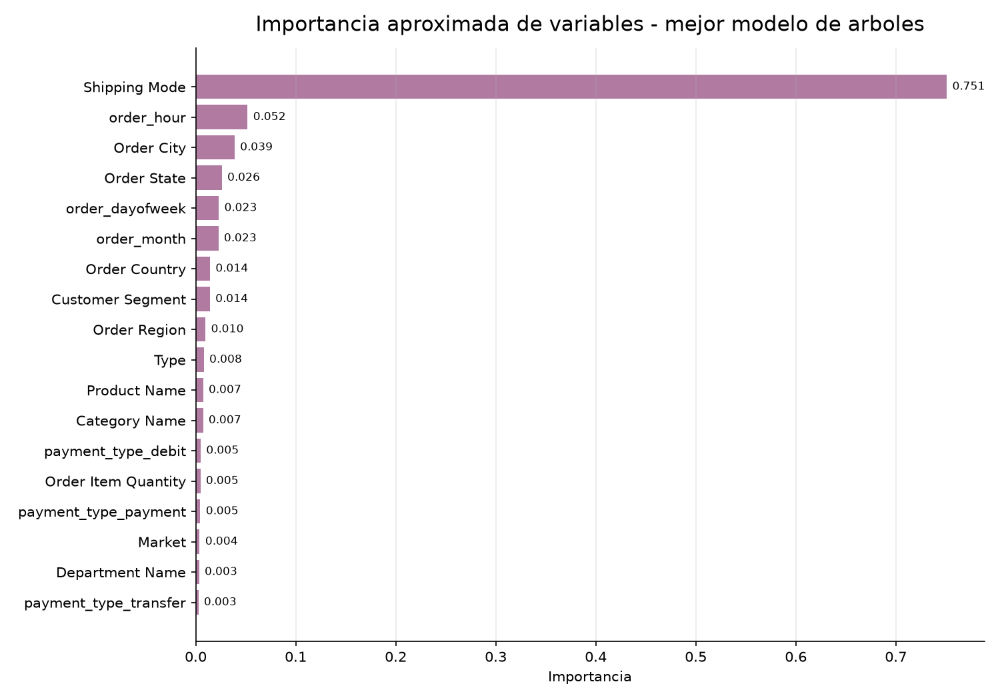

---
title: "Modelo de Prediccion de Llegada de Paquetes"
subtitle: "Experimento realista sin variables de llegada futuras"
author: "Proyecto DataCo"
date: "2026-07-05"
output:
  html_document:
    toc: true
    toc_depth: 2
    number_sections: true
    theme: readable
    df_print: paged
---

```{r setup, include=FALSE}
knitr::opts_chunk$set(echo = FALSE, warning = FALSE, message = FALSE)
```

<div align="center">

# Modelo de Prediccion de Llegada de Paquetes

## DataCo Supply Chain

**Objetivo:** predecir cuantos dias tarda un pedido en llegar y comparar el resultado contra el sistema actual (`Days for shipment (scheduled)`).

</div>

---

# 1. Resumen Ejecutivo

Se entrenaron varios modelos para predecir `Days for shipping (real)` y se compararon contra la promesa actual del sistema (`Days for shipment (scheduled)`).

**Mejor resultado por MAE:** `Random Forest` con MAE `0.9615` dias.

**Sistema actual:** MAE `1.2848` dias.

La comparacion responde una pregunta practica: si el sistema actual promete dias de llegada de forma demasiado rigida, un modelo con pais, ciudad, tipo de envio, comprador, producto, cantidad y fecha del pedido puede mejorar la estimacion. La fecha real de envio/llegada se excluye por leakage.

---

# 2. Variables Usadas

Target:

```text
Days for shipping (real)
```

Prediccion actual usada como comparacion:

```text
Days for shipment (scheduled)
```

Features usadas por los modelos:

| feature |
| --- |
| Shipping Mode |
| Order Country |
| Order Region |
| Order State |
| Order City |
| Market |
| Customer Segment |
| Category Name |
| Department Name |
| Product Name |
| Type |
| Order Item Quantity |
| order_month |
| order_dayofweek |
| order_hour |
| payment_type_cash |
| payment_type_debit |
| payment_type_payment |
| payment_type_transfer |

Features evitadas por leakage o porque solo se conocen despues del pedido:

| leakage_feature |
| --- |
| Delivery Status |
| Late_delivery_risk |
| is_late_delivery |
| shipping date (DateOrders) |
| shipping_datetime |
| shipping_month |
| shipping_dayofweek |
| shipping_hour |
| Days for shipping (real) |
| shipping_hours_from_dates |
| shipping_days_from_dates_exact |
| shipping_days_from_dates_floor |

Features esperadas pero no encontradas:

Sin datos.

---

# 3. Comparacion de Modelos

| model | mae | rmse | r2 | exact_day_accuracy_rounded | within_1_day_accuracy | train_seconds |
| --- | --- | --- | --- | --- | --- | --- |
| Random Forest | 0.9615 | 1.2583 | 0.3936 | 0.3686 | 0.5347 | 16.1284 |
| Gradient Boosting | 0.9654 | 1.2607 | 0.3913 | 0.368 | 0.5303 | 44.7338 |
| Hist Gradient Boosting | 0.9743 | 1.264 | 0.3881 | 0.3684 | 0.5268 | 7.4426 |
| Extra Trees | 0.9765 | 1.2735 | 0.3788 | 0.3695 | 0.5262 | 18.0969 |
| Baseline mean by Shipping Mode | 0.9771 | 1.2642 | 0.3879 | 0.3395 | 0.5258 | 0.0 |
| Lasso Regression | 0.9858 | 1.264 | 0.3881 | 0.3522 | 0.527 | 4.1241 |
| Ridge Regression | 1.0177 | 1.2682 | 0.384 | 0.3354 | 0.5369 | 6.0132 |
| Linear Regression | 1.0188 | 1.2693 | 0.3829 | 0.3346 | 0.5373 | 8.5551 |
| Current system scheduled days | 1.2848 | 1.5913 | 0.0302 | 0.186 | 0.6441 | 0.0 |

## Grafico 1. MAE por modelo



**Lectura:** MAE mide el error medio en dias. Cuanto menor, mejor. La barra del sistema actual muestra cuanto error tiene la promesa fija que ya trae el dataset.


---

## Grafico 2. RMSE por modelo



**Lectura:** RMSE penaliza mas los errores grandes. Sirve para ver si algun modelo falla fuerte en ciertos pedidos.


---

## Grafico 3. Exactitud por dia redondeado



**Lectura:** Mide cuantas veces el modelo acierta exactamente el numero entero de dias despues de redondear la prediccion.


---

# 4. La Promesa Actual de Envio Cumple lo que Dice?

Esta seccion responde la pregunta operativa: si `Same Day` promete mismo dia, `First Class` promete 1 dia, `Second Class` promete 2 dias y `Standard Class` promete 4 dias, cuantos pedidos llegan dentro de esa promesa?

| Shipping Mode | orders | promise_met_pct | promised_days | actual_days |
| --- | --- | --- | --- | --- |
| First Class | 5550 | 0.0 | 1.0 | 2.0 |
| Same Day | 1959 | 46.71 | 0.0 | 0.53 |
| Second Class | 7041 | 20.35 | 2.0 | 3.98 |
| Standard Class | 21554 | 60.33 | 4.0 | 3.99 |

## Grafico 4. Cumplimiento de promesa por tipo de envio



**Lectura:** Aqui se ve si el problema es solo predictivo o tambien operativo. Si un tipo de envio casi nunca cumple su promesa, el problema no es solo el modelo: la promesa/logistica tambien esta mal calibrada.


Lectura clave:

- `First Class` no cumple su promesa en el conjunto de test: promete 1 dia, pero en estos datos llega en 2.
- `Same Day` no siempre significa mismo dia; una parte importante llega en 1 dia.
- `Second Class` promete 2 dias, pero muchas entregas tardan mas.
- `Standard Class` es el modo mejor calibrado en promedio, aunque no perfecto.

---

# 5. Mejor Modelo: Real vs Predicho

## Grafico 5. Dias reales vs dias predichos



**Lectura:** Cada punto compara dias reales contra dias predichos por el mejor modelo. La linea diagonal seria prediccion perfecta.


---

## Grafico 6. Error del mejor modelo por tipo de envio



**Lectura:** Este grafico muestra si el mejor modelo sigue fallando mas en algun modo de envio concreto.


---

# 6. Variables que Parecen Importantes

La tabla siguiente usa importancia aproximada del modelo `Random Forest`. En variables categoricas codificadas ordinalmente debe leerse como orientacion, no como explicacion causal definitiva.

| feature | importance |
| --- | --- |
| Shipping Mode | 0.7509 |
| order_hour | 0.0519 |
| Order City | 0.0388 |
| Order State | 0.0261 |
| order_dayofweek | 0.0231 |
| order_month | 0.0227 |
| Order Country | 0.0143 |
| Customer Segment | 0.0142 |
| Order Region | 0.0098 |
| Type | 0.0081 |
| Product Name | 0.0074 |
| Category Name | 0.0073 |
| payment_type_debit | 0.0049 |
| Order Item Quantity | 0.0046 |
| payment_type_payment | 0.0046 |

## Grafico 7. Importancia aproximada de variables



**Lectura:** Ayuda a ver que variables parecen aportar mas senal para estimar dias de llegada.


---

# 7. Decision para el Proyecto

El sistema actual de promesa de dias es demasiado simple. En los informes anteriores ya se veia que `First Class` y `Second Class` tienen promesas mal calibradas. Este experimento comprueba si modelos basados en informacion del pedido pueden mejorar esa estimacion.

Recomendacion:

1. El mejor modelo mejora claramente al sistema actual, pero solo mejora ligeramente a una regla simple por `Shipping Mode`.
2. Antes de complicar el modelo, conviene recalibrar la promesa base por tipo de envio.
3. Si se avanza, construir features historicas por pais/ciudad/modo de envio sin leakage y volver a evaluar contra el baseline simple.

---

# 8. Nota sobre XGBoost

`xgboost` no estaba instalado en el entorno local. Para cubrir esa familia de modelos se probaron alternativas de gradient boosting disponibles en scikit-learn:

- `HistGradientBoostingRegressor`
- `GradientBoostingRegressor`

Esto mantiene el experimento reproducible sin descargar dependencias nuevas.
