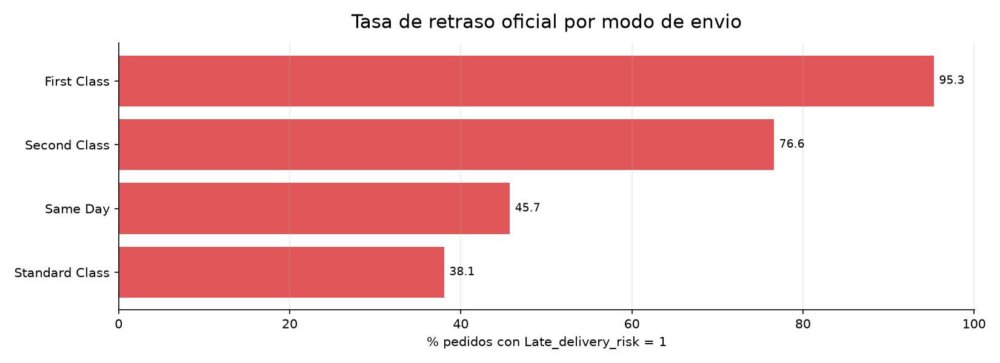
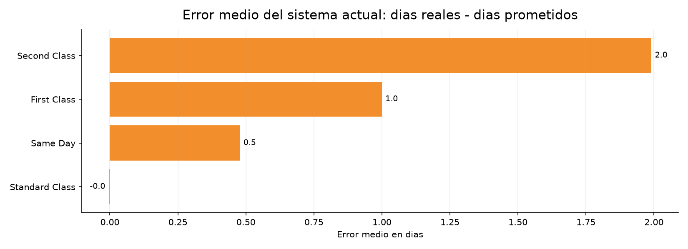
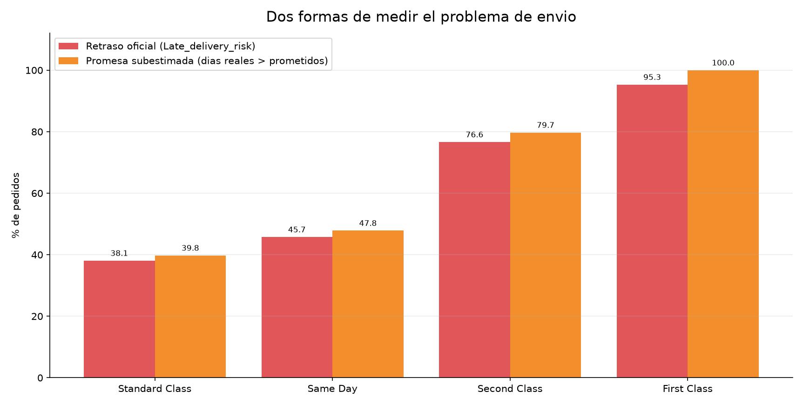
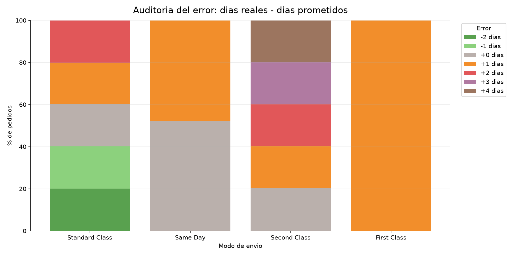
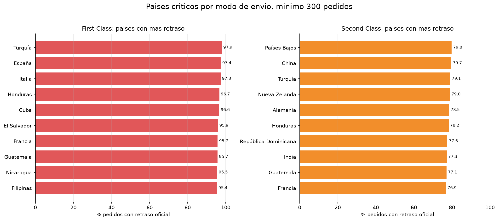
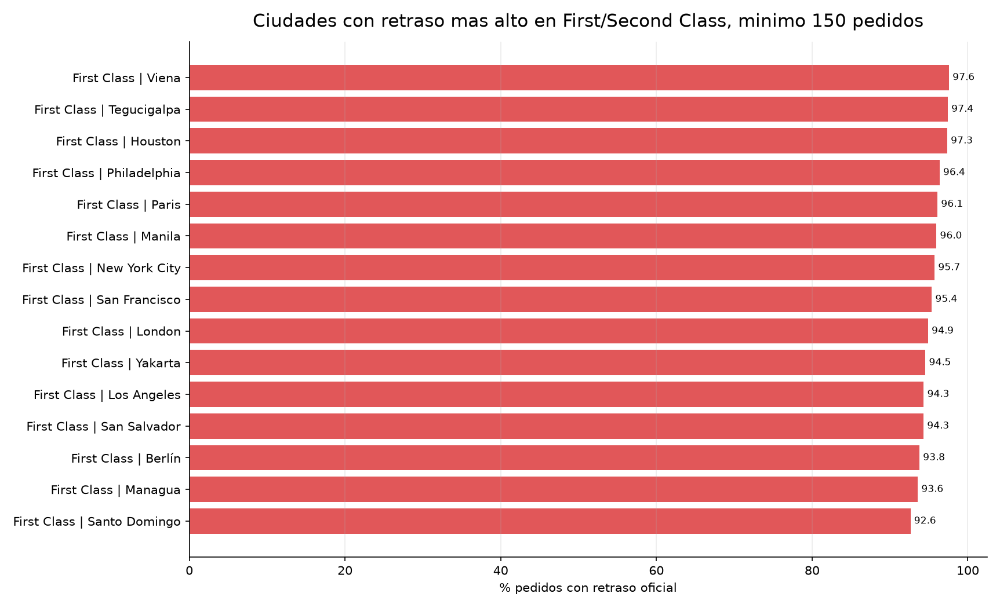
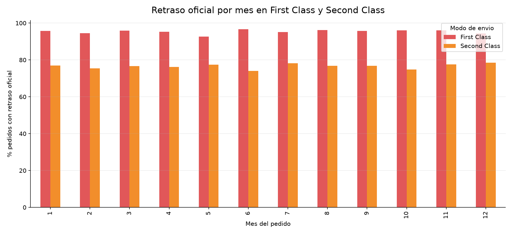



# Informe del Problema de Envio

## DataCo Supply Chain

**Objetivo:** explicar por que los pedidos llegan tarde y si el sistema actual de dias prometidos sirve como prediccion de llegada.

---

# 1. Resumen Ejecutivo

El problema de envio no parece necesitar primero un modelo complejo para detectarse. La senal principal es muy clara: **el retraso esta concentrado en la forma de envio**.

| Hallazgo | Lectura |
| --- | --- |
| `First Class` | Promete `1.0` dia, pero tarda `2.0` dias de media. Retraso oficial: `95.32%`. Promesa subestimada: `100.00%`. |
| `Second Class` | Promete `2.0` dias, pero tarda `3.99` dias de media. Retraso oficial: `76.63%`. |
| `Standard Class` | Esta mucho mejor calibrado en media: promete `4.0` dias y tarda `4.00` dias de media, aunque aun tiene retrasos oficiales en `38.07%`. |

**Conclusion:** el sistema actual que estima cuantos dias tardara un pedido es deficiente, especialmente para `First Class` y `Second Class`. Parece una regla fija por modo de envio, no una prediccion adaptada al pais, ciudad, fecha o contexto del pedido.

---

# 2. Definiciones Usadas

Hay dos formas de medir el problema y conviene separarlas:

| Medida | Formula | Que responde |
| --- | --- | --- |
| Retraso oficial | `Late_delivery_risk == 1` / `is_late_delivery == True` | El dataset marca el pedido como entrega tardia. |
| Promesa subestimada | `Days for shipping (real) > Days for shipment (scheduled)` | El pedido tardo mas dias reales que los prometidos por el sistema. |

Estas dos medidas son muy parecidas, pero no identicas. La diferencia aparece sobre todo en pedidos con `Shipping canceled`: algunos tienen mas dias reales que prometidos, pero no siempre se etiquetan como `Late delivery`.

---

## Grafico 1. Retraso oficial por modo de envio

**Lectura:** `First Class` y `Second Class` son los modos claramente problematicos. `First Class` esta casi siempre tarde y `Second Class` llega tarde en la mayor parte de los pedidos.

---

## Grafico 2. Error medio del sistema actual

**Lectura:** El error medio confirma que la promesa de llegada esta mal calibrada: `First Class` se queda corto por 1 dia y `Second Class` por casi 2 dias.

---

## Grafico 3. Retraso oficial vs promesa subestimada

**Lectura:** Este grafico explica por que algunos porcentajes no coinciden exactamente. `Standard Class` tiene 38.07% de retraso oficial, pero 39.77% de promesa subestimada. No es contradiccion: son definiciones distintas.

---

# 3. Auditoria del Grafico “Demasiado Perfecto”

El grafico de distribucion de error parece demasiado perfecto porque el dataset trae valores muy discretos:

- `First Class`: todos los pedidos tienen 2 dias reales y 1 dia prometido, por eso todos quedan en `+1` dia.
- `Second Class`: todos prometen 2 dias y los dias reales se reparten entre 2, 3, 4, 5 y 6.
- `Standard Class`: todos prometen 4 dias y los dias reales se reparten entre 2, 3, 4, 5 y 6.
- `Same Day`: promete 0 dias y aparece con 0 o 1 dia real.

Esto **no indica que el grafico este mal**. Indica que el sistema actual de promesa de dias es muy simple y probablemente poco personalizado.

Distribucion exacta de `delay_days = dias reales - dias prometidos`:

| Shipping Mode | -2 | -1 | 0 | 1 | 2 | 3 | 4 |
| --- | --- | --- | --- | --- | --- | --- | --- |
| Standard Class | 21666 | 21700 | 21535 | 21111 | 21740 | 0 | 0 |
| Same Day | 0 | 0 | 5080 | 4657 | 0 | 0 | 0 |
| Second Class | 0 | 0 | 7138 | 7065 | 6978 | 7052 | 6983 |
| First Class | 0 | 0 | 0 | 27814 | 0 | 0 | 0 |

---

## Grafico 4. Distribucion del error por modo de envio

**Lectura:** Aqui se ve la estructura artificial/discreta del campo de dias. Es util como auditoria del sistema actual, pero no debe confundirse con una distribucion natural continua.

---

# 4. Paises y Ciudades Criticas

La geografia importa, pero no explica el problema principal tan bien como `Shipping Mode`. En `First Class`, muchos paises tienen tasas cercanas al 95-98%, asi que el problema parece sistemico. En `Second Class`, el patron tambien se repite en varios paises.

## Grafico 5. Paises criticos en First Class y Second Class

**Lectura:** Los paises mas problematicos refuerzan la conclusion, pero no sustituyen al factor principal: la forma de envio.

Paises con mayor retraso oficial y volumen suficiente:

| Shipping Mode | Order Country | orders | official_late_pct | mean_error_days |
| --- | --- | --- | --- | --- |
| First Class | Turquía | 579 | 97.93 | 1.0 |
| First Class | España | 656 | 97.41 | 1.0 |
| First Class | Italia | 733 | 97.27 | 1.0 |
| First Class | Honduras | 537 | 96.65 | 1.0 |
| First Class | Cuba | 498 | 96.59 | 1.0 |
| First Class | El Salvador | 556 | 95.86 | 1.0 |
| First Class | Francia | 2043 | 95.74 | 1.0 |
| First Class | Guatemala | 442 | 95.7 | 1.0 |
| Second Class | Países Bajos | 412 | 79.85 | 1.98 |
| Second Class | China | 1102 | 79.67 | 2.09 |
| Second Class | Turquía | 656 | 79.12 | 2.1 |
| Second Class | Nueva Zelanda | 328 | 78.96 | 2.01 |
| Second Class | Alemania | 1820 | 78.52 | 2.06 |
| Second Class | Honduras | 584 | 78.25 | 1.84 |
| Second Class | República Dominicana | 745 | 77.58 | 2.04 |
| Second Class | India | 1038 | 77.26 | 2.05 |

---

## Grafico 6. Ciudades criticas en First Class y Second Class

**Lectura:** Las ciudades criticas muestran tasas altas, sobre todo en `First Class`, pero el patron sigue pareciendo estructural del modo de envio.

Ciudades con mayor retraso oficial:

| Shipping Mode | Order City | orders | official_late_pct | mean_error_days |
| --- | --- | --- | --- | --- |
| First Class | Viena | 165 | 97.58 | 1.0 |
| First Class | Tegucigalpa | 272 | 97.43 | 1.0 |
| First Class | Houston | 189 | 97.35 | 1.0 |
| First Class | Philadelphia | 193 | 96.37 | 1.0 |
| First Class | Paris | 154 | 96.1 | 1.0 |
| First Class | Manila | 223 | 95.96 | 1.0 |
| First Class | New York City | 351 | 95.73 | 1.0 |
| First Class | San Francisco | 194 | 95.36 | 1.0 |
| First Class | London | 176 | 94.89 | 1.0 |
| First Class | Yakarta | 165 | 94.55 | 1.0 |
| First Class | Los Angeles | 247 | 94.33 | 1.0 |
| First Class | San Salvador | 246 | 94.31 | 1.0 |

---

# 5. Meses: No Parece un Pico Puntual

## Grafico 7. Retraso por mes en First Class y Second Class

**Lectura:** El problema persiste durante todos los meses. No parece una temporada aislada ni un pico puntual.

---

# 6. Tabla Resumen Final

| Shipping Mode | orders | official_late_pct | underestimated_rate_pct | promised_days | actual_days | mean_error_days | canceled_pct |
| --- | --- | --- | --- | --- | --- | --- | --- |
| First Class | 27814 | 95.32 | 100.0 | 1.0 | 2.0 | 1.0 | 4.68 |
| Second Class | 35216 | 76.63 | 79.73 | 2.0 | 3.99 | 1.99 | 4.0 |
| Same Day | 9737 | 45.74 | 47.83 | 0.0 | 0.48 | 0.48 | 4.56 |
| Standard Class | 107752 | 38.07 | 39.77 | 4.0 | 4.0 | -0.0 | 4.27 |

---

# 7. Interpretacion para el Proyecto

El problema actual no es solo que haya pedidos tarde. El problema mas interesante es que **la promesa de dias de llegada no esta bien calibrada**.

- `First Class` deberia prometer 2 dias si se usa una regla simple, no 1.
- `Second Class` necesita una prediccion mas fina: muchas entregas tardan entre 3 y 6 dias.
- `Standard Class` esta mejor calibrado en promedio, pero aun puede mejorarse para casos concretos.
- Pais, ciudad, region, mercado, categoria/producto y fecha pueden ayudar a mejorar una prediccion personalizada.

---

# 8. Siguiente Paso: Modelo de Llegada

Tiene sentido construir un modelo de prediccion de llegada mas eficiente que el sistema actual.

El baseline minimo deberia comparar:

1. **Sistema actual:** `Days for shipment (scheduled)`.
2. **Baseline simple:** media historica por `Shipping Mode`.
3. **Modelo inicial:** prediccion de `Days for shipping (real)` usando variables disponibles en el momento del pedido.

Variables candidatas sin leakage:

- `Shipping Mode`
- `Order Country`, `Order Region`, `Order City`, `Market`
- `order_month`, `order_dayofweek`, `order_hour`
- `Category Name`, `Department Name`, `Product Name`
- `Customer Segment`
- metodo de pago one-hot (`payment_type_*`)

Variables que no deben entrar como features porque filtran el resultado:

- `Delivery Status`
- `Late_delivery_risk`
- `is_late_delivery`
- `shipping date (DateOrders)` / `shipping_datetime`
- `Days for shipping (real)` si se predice llegada
- `shipping_hours_from_dates`
- `shipping_days_from_dates_exact`
- `shipping_days_from_dates_floor`

---

# 9. Nota de Auditoria

La diferencia entre `Standard Class` con 38.07% de retraso oficial y 39.77% de promesa subestimada no es un error del informe. Es una diferencia de definicion. El retraso oficial viene de la etiqueta del dataset; la promesa subestimada sale de comparar dias reales contra dias prometidos.

Tabla de relacion entre `Delivery Status` y promesa subestimada:

| Delivery Status | False | True |
| --- | --- | --- |
| Advance shipping | 100.0 | 0.0 |
| Late delivery | 0.0 | 100.0 |
| Shipping canceled | 42.96 | 57.04 |
| Shipping on time | 100.0 | 0.0 |
